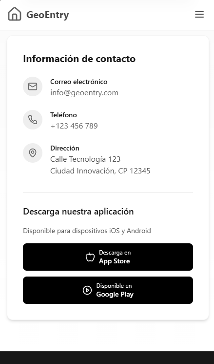

**Universidad Peruana de Ciencias Aplicadas  **

**INFORME DE TRABAJO FINAL**  

Desarrollo de Soluciones IOT  
NRC: 2968  
Carrera de Ingeniería de Software 7to ciclo 
Docente: Marco Antonio Leon Baca  

**Nombre del startup: TechProtection  Nombre del producto: GeoEntry** 

| Código | Apellidos y Nombres |
| --- | --- |
| U202212684 | Elías Sanchez, Harold Miguel |
| U202212338 | López Huamán, Rodrigo Adrián |
| U202212191 | Meneses Arevalo, Victor Manuel |
| U202112655 | Gamboa Delgado, Brayan Stiven |
| U202213646 | Salvador Rodríguez, Rodrigo Jesús |

**Junio 2025**  

**Registro de Versiones del Informe**  

|Versión  |Fecha  |Autor  |Descripción de la modificación  |
| - | - | - | :-: |
|1\.1  |10/04/2025  |TechProtection |Capítulo I  |
|1\.2  |13/04/2025  |TechProtection |Capítulo II  |
|1\.3  |17/04/2025  |TechProtection |Capítulo III  |
|1\.4  |21/04/2025  |TechProtection |Capítulo IV  |
|2\.1  |08/05/2025  |TechProtection |Capítulo V  |
|2\.2  |13/05/2025  |TechProtection |Capítulo VI  |
|3\.1  |06/06/2025  |TechProtection |Capítulo VI  |
|3\.2  |18/06/2025  |TechProtection |Capítulo VI  |

# Contenido

## Tabla de contenidos

### Student Outcome

## Capítulo I: Introducción

### 1.1. Startup Profile
- 1.1.1. Descripción de la Startup
- 1.1.2. Perfiles de integrantes del equipo

### 1.2. Solution Profile
- 1.2.1 Antecedentes y problemática
- 1.2.2 Lean UX Process.
  - 1.2.2.1. Lean UX Problem Statements.
  - 1.2.2.2. Lean UX Assumptions.
  - 1.2.2.3. Lean UX Hypothesis Statements.
  - 1.2.2.4. Lean UX Canvas.

### 1.3. Segmentos objetivo.

## Capítulo II: Requirements Elicitation & Analysis

### 2.1. Competidores.
- 2.1.1. Análisis competitivo.
- 2.1.2. Estrategias y tácticas frente a competidores.

### 2.2. Entrevistas.
- 2.2.1. Diseño de entrevistas.
- 2.2.2. Registro de entrevistas.
- 2.2.3. Análisis de entrevistas.

### 2.3. Needfinding.
- 2.3.1. User Personas.
- 2.3.2. User Task Matrix.
- 2.3.3. User Journey Mapping.
- 2.3.4. Empathy Mapping.
- 2.3.5. As-is Scenario Mapping.

### 2.4. Ubiquitous Language.

## Capítulo III: Requirements Specification

### 3.1. To-Be Scenario Mapping.
### 3.2. User Stories.
### 3.3. Impact Mapping.
### 3.4. Product Backlog.

## Capítulo IV: Solution Software Design

### 4.1. Strategic-Level Domain-Driven Design.
- 4.1.1. EventStorming.
  - 4.1.1.1 Candidate Context Discovery.
  - 4.1.1.2 Domain Message Flows Modeling.
  - 4.1.1.3 Bounded Context Canvases.
- 4.1.2. Context Mapping.
- 4.1.3. Software Architecture.
  - 4.1.3.1. Software Architecture System Landscape Diagram.
  - 4.1.3.2. Software Architecture Context Level Diagrams.
  - 4.1.3.2. Software Architecture Container Level Diagrams.
  - 4.1.3.3. Software Architecture Deployment Diagrams.

### 4.2. Tactical-Level Domain-Driven Design

#### 4.2.1. Bounded Context: Device
- 4.2.1.1. Domain Layer.
- 4.2.1.2. Interface Layer.
- 4.2.1.3. Application Layer.
- 4.2.1.4. Infrastructure Layer.
- 4.2.1.5. Bounded Context Software Architecture Component Level Diagrams.
- 4.2.1.6. Bounded Context Software Architecture Code Level Diagrams.
  - 4.2.1.6.1. Bounded Context Domain Layer Class Diagrams.
  - 4.2.1.6.2. Bounded Context Database Design Diagram

#### 4.2.2. Bounded Context: Security
- 4.2.2.1. Domain Layer.
- 4.2.2.2. Interface Layer.
- 4.2.2.3. Application Layer.
- 4.2.2.4. Infrastructure Layer.
- 4.2.2.5. Bounded Context Software Architecture Component Level Diagrams.
- 4.2.2.6. Bounded Context Software Architecture Code Level Diagrams.
  - 4.2.2.6.1. Bounded Context Domain Layer Class Diagrams.
  - 4.2.2.6.2. Bounded Context Database Design Diagram

#### 4.2.3. Bounded Context: Climate Control
- 4.2.3.1. Domain Layer.
- 4.2.3.2. Interface Layer.
- 4.2.3.3. Application Layer.
- 4.2.3.4. Infrastructure Layer.
- 4.2.3.5. Bounded Context Software Architecture Component Level Diagrams.
- 4.2.3.6. Bounded Context Software Architecture Code Level Diagrams.
  - 4.2.3.6.1. Bounded Context Domain Layer Class Diagrams.
  - 4.2.3.6.2. Bounded Context Database Design Diagram

#### 4.2.4. Bounded Context: User
- 4.2.4.1. Domain Layer.
- 4.2.4.2. Interface Layer.
- 4.2.4.3. Application Layer.
- 4.2.4.4. Infrastructure Layer.
- 4.2.4.5. Bounded Context Software Architecture Component Level Diagrams.
- 4.2.4.6. Bounded Context Software Architecture Code Level Diagrams.
  - 4.2.4.6.1. Bounded Context Domain Layer Class Diagrams.
  - 4.2.4.6.2. Bounded Context Database Design Diagram

#### 4.2.5. Bounded Context: Notification
- 4.2.5.1. Domain Layer.
- 4.2.5.2. Interface Layer.
- 4.2.5.3. Application Layer.
- 4.2.5.4. Infrastructure Layer.
- 4.2.5.5. Bounded Context Software Architecture Component Level Diagrams.
- 4.2.5.6. Bounded Context Software Architecture Code Level Diagrams.
  - 4.2.5.6.1. Bounded Context Domain Layer Class Diagrams.
  - 4.2.5.6.2. Bounded Context Database Design Diagram

## Capítulo V: Solution UI/UX Design

### 5.1. Style Guidelines.
- 5.1.1. General Style Guidelines.
- 5.1.2. Web, Mobile and IoT Style Guidelines.

### 5.2. Information Architecture.
- 5.2.1. Organization Systems.
- 5.2.2. Labeling Systems.
- 5.2.3. SEO Tags and Meta Tags
- 5.2.4. Searching Systems.
- 5.2.5. Navigation Systems.

### 5.3. Landing Page UI Design.
- 5.3.1. Landing Page Wireframe.
- 5.3.2. Landing Page Mock-up.

### 5.4. Applications UX/UI Design.
- 5.4.1. Applications Wireframes.
- 5.4.2. Applications Wireflow Diagrams.
- 5.4.2. Applications Mock-ups.
- 5.4.3. Applications User Flow Diagrams.

### 5.5. Applications Prototyping.

## Capítulo VI: Product Implementation, Validation & Deployment

### 6.1. Software Configuration Management.
- 6.1.1. Software Development Environment Configuration.
- 6.1.2. Source Code Management.
- 6.1.3. Source Code Style Guide & Conventions.
- 6.1.4. Software Deployment Configuration.

### 6.2. Landing Page, Services & Applications Implementation.

#### 6.2.1. Sprint 1
- 6.2.1.1. Sprint Planning 1.
- 6.2.1.2. Aspect Leaders and Collaborators.
- 6.2.1.3. Sprint Backlog 1.
- 6.2.1.4. Development Evidence for Sprint Review.
- 6.2.1.5. Testing Suite Evidence for Sprint Review.
- 6.2.1.6. Execution Evidence for Sprint Review.
- 6.2.1.7. Services Documentation Evidence for Sprint Review.
- 6.2.1.8. Software Deployment Evidence for Sprint Review.
- 6.2.1.9. Team Collaboration Insights during Sprint.

#### 6.2.2. Sprint 2
- 6.2.2.1. Sprint Planning 2.
- 6.2.2.2. Aspect Leaders and Collaborators.
- 6.2.2.3. Sprint Backlog 2.
- 6.2.2.4. Development Evidence for Sprint Review.
- 6.2.2.5. Testing Suite Evidence for Sprint Review.
- 6.2.2.6. Execution Evidence for Sprint Review.
- 6.2.2.7. Services Documentation Evidence for Sprint Review.
- 6.2.2.8. Software Deployment Evidence for Sprint Review
- 6.2.2.9. Team Collaboration Insights during Sprint.

### 6.3. Validation Interviews
- 6.3.1. Diseño de Entrevistas
- 6.3.2. Registro de Entrevistas
- 6.3.3. Evaluaciones según heurísticas

### 6.4. Video About-the-Product

### **Student Outcome**

| **Criterio específico**                                                                                       | **Acciones realizadas**                                                                                                                                                                                                                                                                                                                                                                                                                                                                                                                                                                                                                                                                                                                                                                                                                                                                                                                                                                                                                                                                                                                                                                                                                                                                                                                                                                                                                                                                                                                                                                                                                                                                                                                                                                           | **Conclusiones** |
|----------------------------------------------------------------------------------------------------------------|---------------------------------------------------------------------------------------------------------------------------------------------------------------------------------------------------------------------------------------------------------------------------------------------------------------------------------------------------------------------------------------------------------------------------------------------------------------------------------------------------------------------------------------------------------------------------------------------------------------------------------------------------------------------------------------------------------------------------------------------------------------------------------------------------------------------------------------------------------------------------------------------------------------------------------------------------------------------------------------------------------------------------------------------------------------------------------------------------------------------------------------------------------------------------------------------------------------------------------------------------------------------------------------------------------------------------------------------------------------------------------------------------------------------------------------------------------------------------------------------------------------------------------------------------------------------------------------------------------------------------------------------------------------------------------------------------------------------------------------------------------------------------------------------------|------------------|
| Trabaja en equipo para proporcionar liderazgo en forma conjunta                                               | **Harold Miguel Elías Sanchez** TB1: En el desarrollo de *Strategic‑Level Domain‑Driven Design*, lideré sesiones de *EventStorming* donde impulsé la identificación colaborativa de contextos candidatos y flujos de mensajes, promoviendo una participación activa y equitativa del equipo para consolidar decisiones clave del dominio.  TP:En esta sección, participé activamente en la definición y estandarización de guías de estilo para asegurar consistencia visual y de interacción en las plataformas Web, Mobile e IoT. Propuse pautas para tipografía, colores y patrones de navegación, considerando principios de accesibilidad y usabilidad en cada plataforma. **TB2**: Lideré la implementación del Edge API y la integración con sistemas embebidos, coordinando sesiones de pair programming para asegurar la comunicación efectiva entre dispositivos IoT y la plataforma central. Promoví decisiones técnicas colaborativas que optimizaron el rendimiento del edge computing, estableciendo protocolos de testing distribuido que validaron la funcionalidad en tiempo real.   **Victor Manuel Meneses Arévalo** TB1: En el capítulo *Requirements Elicitation & Analysis*, participé en el análisis de competidores y en el diseño y realización de entrevistas; contribuí con *User Personas*, *User Journey Mapping* y *Empathy Mapping*, fortaleciendo la comprensión de las necesidades de usuario.  TP: He demostrado mi capacidad para trabajar en equipo y proporcionar liderazgo de manera conjunta al participar activamente en el proceso de Elicitación y Análisis de Requisitos. A través de mi contribución en el análisis de competidores, el diseño y realización de entrevistas, y la creación de User Personas, User Journey Mapping y Empathy Mapping, influí en la comprensión profunda de las necesidades del usuario por parte del equipo, guiando la identificación de requisitos centrados en sus perspectivas. **TB2**: Coordine el desarrollo de la aplicación móvil liderando la implementación de funcionalidades de monitoreo y control remoto. Facilité la integración colaborativa con las APIs REST, promoviendo sesiones de code review que aseguraron la calidad del código y la consistencia en la experiencia de usuario entre diferentes plataformas móviles.   **Brayan Stiven Gamboa Delgado** TB1: En *Software Architecture*, contribuí a la creación del *C4 Model* (Landscape, System Context, Containers y Deployment) para un entendimiento claro y compartido del sistema. TP:Lideré la creación del C4 Model, guiando al equipo en la definición de los niveles Landscape, Context y Containers. Establecí sesiones de revisión para asegurar coherencia entre los diferentes niveles de abstracción del sistema.  **TB2**: Dirigí la implementación de la arquitectura web frontend siguiendo los principios del C4 model, liderando sesiones de planificación técnica para la integración con APIs REST. Promoví un liderazgo distribuido donde cada miembro del equipo contribuyó a las decisiones de diseño de componentes, asegurando una solución web escalable y mantenible.   **Rodrigo Adrián López Huamán** TB1: En *Tactical‑Level Domain‑Driven Design*, estructuré y documenté cinco *Bounded Contexts* (Domain, Interface, Application e Infrastructure) y elaboré diagramas de componentes, clases de dominio y diseño de base de datos para cada contexto. TP: Coordine el desarrollo de 5 Bounded Contexts, estableciendo estándares para las capas Domain, Application e Infrastructure. Mediante revisiones técnicas grupales, aseguramos consistencia en diagramas de clases y esquemas de base de datos.  **TB2**: Lideré el desarrollo de las APIs REST implementando los 5 Bounded Contexts, coordinando sesiones de diseño colaborativo para definir endpoints y esquemas de datos. Promoví la participación activa del equipo en decisiones arquitectónicas, estableciendo estándares de desarrollo que facilitaron la integración entre web, mobile y edge systems.   **Rodrigo Jesús Salvador Rodríguez** TB1: En *Introduction* y *Requirements Specifications*, describí la propuesta de startup (*Lean UX*, *Solution Profile*, segmentos objetivos), y redacté escenarios, *User Stories* y *Product Backlog*. TP: Lideré la priorización del Product Backlog mediante técnicas de Story Mapping, asegurando que las User Stories reflejaran necesidades reales. Establecí criterios de aceptación claros para mantener la trazabilidad con los objetivos del negocio.  **TB2:** Lideré la integración del sistema embebido con la plataforma central, coordinando la implementación de protocolos de comunicación IoT. Facilité sesiones colaborativas de testing end-to-end que validaron la funcionalidad completa del sistema, promoviendo decisiones técnicas consensuadas que optimizaron la performance del sistema embebido.|                  |
| Crea un entorno colaborativo e inclusivo, establece metas, planifica tareas y cumple objetivos                 | **Harold Miguel Elías Sanchez** TB1: Fomenté un ambiente inclusivo guiando al equipo en la creación de *Bounded Context Canvases* y mapas de contexto, estableciendo metas claras y asignando tareas estratégicas que facilitaron el cumplimiento eficiente de los objetivos.  TP1:Colaboré en el diseño de la arquitectura de información, definiendo sistemas de organización, etiquetado, SEO, búsqueda y navegación. Estructuré taxonomías y jerarquías de contenido, optimicé meta tags y establecí flujos de búsqueda intuitivos para mejorar la experiencia del usuario. **TB2:** Establecí metas claras para la implementación del Edge API, creando un ambiente inclusivo mediante la asignación estratégica de tareas de desarrollo y testing. Planifiqué sprints estructurados que permitieron la colaboración efectiva entre equipos de embedded systems y backend, cumpliendo objetivos de latencia y rendimiento en tiempo real.   **Brayan Stiven Gamboa Delgado** TB1: Planifiqué el entorno de trabajo colaborativo, definiendo objetivos y plazos para la entrega del informe y la elaboración del *C4 Model*. TP: Planifiqué hitos claros para la entrega de la arquitectura, asignando responsabilidades en la documentación del C4 Model. Fomenté un enfoque colaborativo que permitió un entendimiento unificado del sistema entre todos los miembros. **TB2:** Planifiqué hitos específicos para el desarrollo web, estableciendo objetivos claros de funcionalidad y performance. Fomenté un entorno colaborativo mediante daily standups y retrospectivas que permitieron la adaptación ágil a los requerimientos, asegurando la entrega exitosa de la plataforma web con integración completa a las APIs.    **Victor Manuel Meneses Arévalo** TB1: Participé activamente en la creación de un entorno colaborativo durante las sesiones de análisis y diseño de las herramientas de comprensión del usuario (User Personas, User Journey Mapping, Empathy Mapping). Contribuí a establecer metas claras para la recopilación y síntesis de la información obtenida en las entrevistas y el análisis de competidores, y colaboré en la planificación de las tareas necesarias para generar estos entregables, asegurando así el cumplimiento de los objetivos de comprensión de las necesidades del usuario.  TP1: Durante la definición y estandarización de guías de estilo, fomenté un entorno de colaboración al compartir mis perspectivas sobre la usabilidad y accesibilidad en las diferentes plataformas (Web, Mobile e IoT). Participé en el establecimiento de metas para asegurar la consistencia visual y de interacción, y colaboré en la planificación de las tareas relacionadas con la propuesta de pautas para tipografía, colores y patrones de navegación, contribuyendo al objetivo de mejorar la experiencia del usuario en todas las plataformas.  **TB2:** Organicé la implementación móvil estableciendo metas específicas de usabilidad y performance, distribuyendo tareas que aprovecharon las fortalezas individuales del equipo. Creé un ambiente inclusivo mediante sesiones de feedback continuo y pair programming, cumpliendo objetivos de compatibilidad cross-platform y experiencia de usuario optimizada.   **Rodrigo Adrián López Huamán** TB1: Promoví el trabajo colaborativo liderando entrevistas, mapas de empatía y *User Personas*; establecí objetivos y coordiné tareas para una recolección efectiva de información. TP: Definí metas específicas para cada Bounded Context, planificando iteraciones que permitieron avanzar en paralelo. Promoví pair programming para mantener coherencia en los diseños, cumpliendo con los objetivos técnicos en los plazos establecidos.  **TB2:** Definí metas técnicas específicas para cada API REST, planificando iteraciones que permitieron el desarrollo paralelo de múltiples endpoints. Fomenté un entorno inclusivo mediante code reviews colaborativos y documentación compartida, cumpliendo objetivos de rendimiento, seguridad y escalabilidad en todas las APIs implementadas.  **Rodrigo Jesús Salvador Rodríguez** TB1: Planifiqué un entorno colaborativo en la elaboración de *Startup Profile*, *Solution Profile*, segmentos objetivos y *Requirements Specifications*, demostrando responsabilidad y alineación con los objetivos del equipo. TP: Organicé workshops colaborativos para definir el Startup Profile y Solution Profile, integrando aportes de todos los miembros. Asigné tareas específicas que permitieron consolidar una visión unificada de los segmentos objetivos y requerimientos.  **TB2:** Planifiqué la integración del sistema embebido estableciendo objetivos claros de conectividad y monitoreo en tiempo real. Creé un entorno colaborativo mediante workshops técnicos y sesiones de troubleshooting grupal, asignando tareas específicas que permitieron cumplir los objetivos de comunicación IoT y recolección de datos del sistema embebido.                                                                                                                                                                                                                                                                                                                                                                                                                                                                                                                                                                                                                                                                                                                                                             |                  |

Capítulo I: Introducción 

1. Startup Profile 

En esta sección se presenta la descripción del startup y los perfiles de los miembros del equipo. 

1. Descripción de la Startup 

La startup, presentada con el nombre de TechProtection, nace con el propósito de transformar la forma en que las personas interactúan con sus hogares, ofreciendo una solución tecnológica inteligente que combina comodidad, seguridad y eficiencia. Proponemos un sistema de automatización residencial que se activa de manera inteligente al detectar la proximidad del usuario, logrando que el hogar se adapte de forma automática a sus necesidades y preferencias. 

El sistema integra diversas funciones como una cerradura electrónica, iluminación automatizada mediante sensores de luminicidad, control ambiental (temperatura) y aromatización personalizada del ambiente. Todo esto se encuentra interconectado y es gestionado desde una aplicación móvil intuitiva, permitiendo al usuario controlar y personalizar su entorno desde cualquier lugar. 

GeoEntry no solo mejora la experiencia del usuario al llegar a casa, sino que también promueve la eficiencia energética y el bienestar, adaptándose dinámicamente a las rutinas diarias. Este sistema está diseñado especialmente para personas que valoran la tecnología, la seguridad y el confort en su vida cotidiana. 

Misión: Redefinir la experiencia de llegada al hogar mediante una solución inteligente y automatizada que prioriza la comodidad, seguridad y bienestar de nuestros usuarios. 

Visión: Convertirnos en la solución líder de automatización del hogar inteligente en Latinoamérica, destacando por nuestra innovación, personalización y compromiso con la mejora de la calidad de vida de las personas. 

Logotipo de la Startup: 

Logotipo del servicio: 

2. Perfiles de integrantes del equipo 

|Miembros |Codigo estudiante |Carrera |Descripción |
| - | :- | - | - |
|

Brayan Stiven Gamboa Delgado 
|U202112655 |Ingeniería de Software |Soy un estudiante que está cursando el 8vo ciclo de la carrera de Ingeniería de Software.Tengo experiencia en html, css y js. Me considero una persona puntual y responsable. Me esfuerzo en realizar los trabajos a tiempo y crecer profesionalmente. |
|

Harold Miguel Elias Sanchez 
|U202212684 |Ingeniería de Software |Soy un estudiante que se encuentra en el séptimo ciclo de la carrera de ingeniería de software. Mi conocimiento técnico abarca el lenguaje C++ y Python, que manejo de manera intermedia. Además, poseo habilidades básicas que me permiten contribuir efectivamente en equipos, aportando ideas y trabajando en colaboración para alcanzar nuestras metas conjuntas. |

|

Rodrigo Adrián López Huamán  
|U202212338 |Ingeniería de Software|Mi nombre es Rodrigo Adrián López Huamán, estudiante de séptimo ciclo de Ingeniería de Software, tengo 19 años y me considero un chico responsable y comprometido con mis actividades. Además, de ser una persona creativa y capaz de trabajar en equipo para alcanzar nuestras metas. También tengo habilidades en el manejo de conflictos, lo que me permite resolver situaciones difíciles de manera efectiva. Estoy emocionado de seguir aprendiendo y creciendo en esta carrera. |
| - | - | - | :-: |
|

Rodrigo Jesús Salvador Rodríguez  
|U202213646  |Ingeniería de Software|Mi nombre es Rodrigo Jesus Salvador Rodriguez, tengo 19 años, estudio la carrera de Ingeniería de Software en la Universidad Peruana de Ciencias Aplicadas (UPC). Me considero una persona responsable y puntual en todo tipo de aspectos, esto lo voy a ver reflejado en este proyecto, como miembro de este equipo me comprometo a seguir las indicaciones al pie de la letra, seguir recomendaciones y apoyar siempre a mis compañeros para presentar el mejor proyecto grupal. |
|

Victor Manuel Meneses Arevalo  
|` `U202212191 |Ingeniería de Software|Soy estudiante de Ingeniería de Software en la Universidad Peruana de Ciencias Aplicadas. Me identifico como una persona comprometida, proactiva y orientada al trabajo en equipo. Durante el desarrollo de este proyecto, me comprometo a seguir las directrices establecidas, colaborar activamente con mis compañeros y aportar lo mejor de mí para alcanzar los objetivos propuestos y presentar un proyecto de alta calidad grupal. |

2. **Solution Profile** 

Para entender adecuadamente el perfil de la solución, es imprescindible analizar la naturaleza del problema que estamos tratando de resolver. Esto implica identificar con detalle los aspectos fundamentales que nuestra solución debe abordar y establecer objetivos y restricciones que orienten  nuestra  definición.  Con  el  fin  de  facilitar  este  proceso  de  análisis  y  enfoque, emplearemos herramientas ampliamente reconocidas como "Las 5W y 2H" y el "Proceso Lean UX". 

1. Antecedentes y problemática 
1. What/Qué 

¿Cuál es el problema? 

En la actualidad, muchas personas no cuentan con un sistema automatizado que les permita disfrutar de una experiencia cómoda, segura y eficiente al llegar a sus hogares. La falta de integración entre dispositivos inteligentes y la ausencia de activación automática basada en geolocalización  provocan  que  los  usuarios  deban  interactuar  manualmente  con  múltiples sistemas (cerraduras, luces, temperatura, fragancias), lo cual disminuye la comodidad y afecta la eficiencia energética del hogar. 

2. Why/Por  qué ¿Cuál es la causa del problema? La causa principal radica en la fragmentación del ecosistema de dispositivos inteligentes y en la falta de soluciones que utilicen geolocalización en tiempo real para activar funciones del hogar.  A  esto  se  suma  que  muchas  personas  desconocen  el  potencial  de  automatización contextual y continúan usando métodos manuales poco eficientes. 
2. Who/Quién ¿Quiénes están involucrados? 

   Están  involucrados  instaladores  de  domótica,  desarrolladores  de  viviendas  inteligentes,  y eventualmente, empresas del rubro inmobiliario que deseen incluir esta tecnología como valor agregado. 

   ¿Quién lo utilizará? 

   Los usuarios principales del sistema son personas con estilo de vida activo, profesionales y familias que buscan mayor comodidad y eficiencia en la gestión de su hogar. 

4. When/Cuándo 

¿Cuándo sucede el problema? 

El problema se manifiesta especialmente en momentos en los que los usuarios llegan a casa cargados, con poco tiempo, o simplemente desean una bienvenida más personalizada. La falta de automatización inteligente obliga a realizar múltiples acciones manuales para adaptar el ambiente del hogar, lo cual resulta poco práctico en la rutina diaria. 

5. Where/Dónde 

¿A dónde se dirige? 

El problema surge principalmente en zonas urbanas y residenciales, especialmente a personas con interés en hogares inteligentes, tecnología y confort, ofreciendo una solución unificada que optimiza su estilo de vida. 

¿Dónde surge el problema? 

Este problema es común en este segmento del mercado, donde los usuarios ya cuentan con dispositivos  inteligentes,  pero  carecen  de  una  integración  automatizada  que  funcione  en función de la proximidad del usuario. 

6. How/Cómo 

¿Cómo se utilizará el producto? 

El usuario instalará la app de GeoEntry en su smartphone. Al detectar que el usuario se aproxima  a  su  vivienda,  el  sistema  activará  automáticamente  funciones  configuradas previamente como el desbloqueo de la puerta, el encendido de luces, el ajuste del clima interior y la liberación de fragancias ambientales. Todo esto estará conectado a través de una red domótica y gestionado desde la app. 

¿Cómo lograremos la correcta integración del sistema? 

GeoEntry integrará sensores de luminicidad, cerraduras electrónicas, controladores de clima, aromatizadores  y  geolocalización  mediante  una  interfaz  intuitiva.  Los  dispositivos  se conectarán vía Wi-Fi o Bluetooth, y se podrá configurar rutinas según las preferencias del usuario, todo respaldado por protocolos de seguridad digital. 

7. How much/Cuánto 

¿Cuál es la magnitud del problema? 

Según datos de Statista (2023), el mercado global de hogares inteligentes alcanzó los USD 126 mil millones en 2022, y se proyecta un crecimiento sostenido del 11% anual. En América Latina, el interés en soluciones de automatización sigue en aumento. GeoEntry se posiciona como una solución innovadora en un sector con gran potencial. Se estima que al menos un 30-40% de los hogares con acceso a internet y dispositivos inteligentes podrían beneficiarse con la propuesta de valor de GeoEntry en los próximos cinco años. 

¿Qué porcentaje del personal de la industria se verá beneficiado por el servicio? 

Se estima que entre un 45% y 65% del personal vinculado a la administración, seguridad y mantenimiento de viviendas unifamiliares y conjuntos residenciales podría beneficiarse del uso de GeoEntry. 

2. Lean UX Process. 
1. Lean UX Problem Statements. 

Problem Statement: 

El propósito de GeoEntry es ofrecer a los usuarios una experiencia automatizada, cómoda y personalizada al llegar a casa, integrando múltiples funciones inteligentes como apertura de puertas,  iluminación,  climatización  y  ambientación  aromática,  todo  activado  mediante geolocalización. 

El problema actual se manifiesta en la falta de integración efectiva entre los dispositivos inteligentes existentes en el hogar. Los usuarios deben gestionar manualmente cada dispositivo (como  luces,  cerraduras,  termostatos,  difusores  de  aroma),  lo  cual  resulta  tedioso, especialmente al llegar a casa en momentos de cansancio o con las manos ocupadas. Esta dependencia de acciones individuales reduce significativamente la experiencia de comodidad y puede derivar en olvidos, como dejar luces encendidas o puertas sin cerrar. 

Además, la falta de automatización basada en el contexto del usuario (como su ubicación) implica que el hogar no se adapta a sus necesidades en tiempo real. Esto reduce la eficiencia energética, el confort y el potencial de una vida más conectada. 

¿Cómo podríamos automatizar de forma eficiente la interacción entre el usuario y su hogar al detectar su llegada, integrando funciones clave sin necesidad de intervención manual? 

2. Lean UX Assumptions. 

Business Assumptions: 

1. Creemos  que  nuestros  usuarios  necesitan  una  solución  integrada  que  les  permita automatizar  su  hogar  de  manera  eficiente  y  personalizada,  activándose automáticamente con base en su proximidad. 
1. Estas necesidades se pueden satisfacer mediante una plataforma que conecte cerraduras electrónicas, sensores de luz, climatización y aromatización en una única aplicación inteligente y configurable. 
1. Nuestros clientes iniciales serán personas tecnológicas, jóvenes profesionales, familias modernas y propietarios de viviendas inteligentes ubicados en zonas urbanas. 
1. El valor más importante que un cliente quiere de nuestros servicios es la comodidad automatizada al llegar a casa, sin necesidad de realizar acciones manuales. 
1. El cliente también se beneficiará de ahorros energéticos, seguridad reforzada y un ambiente hogareño siempre preparado para su llegada. 
1. Vamos a obtener la mayoría de los clientes mediante publicidad en redes sociales, alianzas con inmobiliarias y recomendaciones boca a boca. 
7. Vamos a obtener ingresos mediante un modelo de venta directa de hardware con integración gratuita de la app, así como planes de suscripción para funciones premium (automatizaciones avanzadas, control remoto, historial de actividades, etc.) 
7. Nuestra  competencia  en  el  mercado  serán  aplicaciones  de  gestión  ganadera  con modelos genéricos, hojas de cálculo digitales, o métodos tradicionales como cuadernos de registro. 
7. Vamos a tener ventaja frente a nuestra competencia debido a que incluye soluciones parciales como Google Home, Alexa o dispositivos IoT independientes. Sin embargo, GeoEntry tiene la ventaja de automatización basada en geolocalización y experiencia completamente integrada al entrar al hogar. 
7. El  mayor  riesgo  del  servicio  es  que  los  usuarios  no  adopten  rápidamente  la automatización  por  desconocimiento  tecnológico,  desconfianza  en  los  sistemas automatizados o miedo a perder control manual. 
7. Lo resolveremos realizando una interfaz intuitiva, procesos de instalación asistida y contenido educativo que demuestre los beneficios y seguridad de la plataforma. 

User Assumptions: 

¿Quién es el usuario? 

Los usuarios principales de GeoEntry son personas que desean automatizar su hogar para mejorar  su  experiencia  diaria:  jóvenes  profesionales,  familias  tecnológicas,  usuarios  con rutinas definidas y personas que ya cuentan con dispositivos inteligentes en casa (cerraduras, luces, termostatos, difusores, etc.). Si el producto tiene éxito en este grupo inicial, se planea expandir hacia soluciones empresariales y de hospitalidad (como hoteles boutique o Airbnbs) que buscan automatizar la llegada del cliente y brindar una experiencia personalizada. 

¿Qué problemas tiene nuestro producto? ¿Qué resuelve? 

Un desafío actual es que muchos hogares inteligentes funcionan con sistemas fragmentados: el usuario debe abrir una app para la cerradura, otra para el termostato y otra para las luces. Esta falta de integración interfiere con la fluidez de la experiencia. GeoEntry resuelve este problema al activar automáticamente todos estos sistemas cuando el usuario se aproxima a casa, usando su ubicación en tiempo real. También elimina la fricción de tener que realizar múltiples tareas al llegar al hogar. 

¿Qué características son importantes? 

GeoEntry ofrece una solución integral que permite la activación automática de funciones clave del hogar —como cerraduras, luces, temperatura y aroma— basándose en la geolocalización del usuario. Además, brinda la posibilidad de personalizar escenarios de entrada según el horario, el clima o el día de la semana, adaptándose así a las rutinas del usuario. La plataforma permite visualizar y monitorear el historial de accesos y automatizaciones, facilitando el control completo del entorno residencial. También se integra con múltiples dispositivos inteligentes del hogar y ofrece configuraciones de alertas ante situaciones anómalas, como entradas no autorizadas o puertas abiertas, reforzando así la seguridad y comodidad del usuario. 

¿Dónde encaja nuestro producto en su trabajo o vida? 

GeoEntry  encaja  como  una  solución  diaria  de  automatización  del  hogar.  Se  integra naturalmente con las rutinas del usuario: al llegar a casa del trabajo, al volver de compras, al recoger a los niños, etc. Reduce estrés, mejora la seguridad y transforma la llegada al hogar en una experiencia personalizada y eficiente. 

¿Cuándo y cómo es nuestro producto? ¿Usado? 

El servicio se usa principalmente cuando el usuario se aproxima a su hogar. A través de la detección  geográfica,  la  aplicación  activa  automáticamente  los  dispositivos  configurados. También puede utilizarse manualmente dentro de la app para personalizar automatizaciones, revisar estadísticas o modificar configuraciones según nuevas rutinas. 

¿Cómo debe verse nuestro producto y cómo debe comportarse? 

El producto debe tener una interfaz moderna, limpia, intuitiva y amigable, que inspire confianza y eficiencia. Debe permitir una configuración rápida y fácil, con flujos guiados y simples para personalizar escenas. Además, debe funcionar de forma fluida en segundo plano, consumiendo poca batería y respetando los permisos de privacidad. El comportamiento del sistema debe priorizar la seguridad, la velocidad de reacción y la conectividad confiable con los dispositivos. 

Feature Assumptions: 

- Creemos que la aplicación debe tener una interfaz intuitiva que facilite a cualquier usuario la configuración de automatizaciones sin necesidad de conocimientos técnicos. 
- Creemos que debe contar con notificaciones inteligentes y personalizables, que alerten sobre eventos como puertas abiertas, entrada de personas no reconocidas o fallos de conexión. 
- Creemos que la plataforma debe integrarse con asistentes como Alexa, Google Home y Apple HomeKit, así como con dispositivos de terceros como cerraduras, luces y difusores de marcas populares. 
- Creemos que debe incluir un panel visual donde el usuario pueda ver estadísticas de uso, historial de entradas y salidas, y reportes semanales de automatización. 
3. Lean UX Hypothesis Statements. 

Hypothesis  Statement  1 

Creemos  que  los  usuarios  interesados  en  domótica  (usuarios  con  rutinas  establecidas,  familias tecnológicas o profesionales jóvenes) estarán dispuestos a adoptar GeoEntry para automatizar su hogar basándose  en  su  ubicación  en  tiempo  real. Sabremos  que  hemos  tenido  éxito Cuando al menos el 70% de los usuarios registrados configuren y utilicen al menos una automatización geolocalizada dentro de los primeros 30 días de uso. 

Hypothesis  Statement  2 

Creemos que GeoEntry reducirá la fricción al llegar al hogar al permitir que varios dispositivos (luces, cerraduras,  termostatos,  aromas)  se  activen  automáticamente  sin  intervención  del  usuario. Sabremos  que  hemos  tenido  éxito Cuando se registre un incremento del 60% en la automatización de tareas repetitivas (como abrir la puerta  o  encender  luces)  en  comparación  con  el  uso  manual  dentro  del  primer  mes.

Hypothesis  Statement  3 

Creemos  que  la integración  visual  de  datos  de  uso (historial  de entradas,  consumos  energéticos, frecuencia de automatizaciones) permitirá a los usuarios tomar decisiones más inteligentes para mejorar su  eficiencia  doméstica. Sabremos  que  hemos  tenido  éxito Cuando al menos el 65% de los usuarios interactúen semanalmente con el panel de estadísticas de uso y realice cambios en sus automatizaciones en base a estos datos.

Hypothesis Statement 4 

Creemos que una interfaz simple, moderna y centrada en el usuario facilitará la adopción del sistema, incluso  para  personas  sin  experiencia  previa  con  domótica. Sabremos  que  hemos  tenido  éxito Cuando el índice de configuración inicial completa supere el 85% y el índice de abandono durante la primera semana sea menor al 15%.

4. Lean UX Canvas. 

El Lean UX Canvas es una herramienta utilizada en el campo del diseño centrado en el usuario (UX) y la metodología Lean para crear y desarrollar productos de manera más eficiente y efectiva. Su objetivo es proporcionar un marco estructurado para la colaboración entre equipos multidisciplinarios. A continuación se presenta el Lean UX Canvas trabajado por el equipo a través de la herramienta digital Mural: 

Enlace para acceder al[ Canvas ](https://app.mural.co/t/gantrace0893/m/gantrace0893/1744917543273/a7031886527872ab596b7677e3d49ed62b06bcd9?sender=u10ba1755a935234d144c5633)

3. Segmentos objetivo 

En el Perú, el mercado de casas inteligentes alcanzó un valor de USD 410,29 millones en 2024, con una proyección de crecimiento anual del 13,1% hasta 2034 . Este aumento está impulsado por la creciente adopción de tecnologías avanzadas y la demanda de soluciones que mejoren la comodidad y seguridad en el hogar. 

Además, la percepción de inseguridad ha llevado a un incremento en la demanda de sistemas de seguridad  doméstica.  Entre  enero  y  abril  de  2023,  los  robos  en  hogares  y  negocios  aumentaron aproximadamente un 20% en comparación con el mismo período del año anterior . En Lima, solo el 30% de los hogares cuenta con algún sistema de seguridad, aunque un 47% considera instalar uno, reflejando una creciente preocupación por la seguridad. 

GeoEntry  se  posiciona  como  una  solución  ideal  para  personas  que  buscan  integrar  tecnología  y seguridad en su vida diaria. Su sistema de automatización residencial, que se activa mediante la detección de proximidad del usuario, ofrece una experiencia personalizada al llegar a casa, combinando comodidad, eficiencia energética y seguridad. 

1\.3.1 Stakeholders 

Stakeholders Internos: 

- Equipo de desarrollo de GeoEntry. 
- Diseñadores de experiencia de usuario (UX/UI). 
- Especialistas en marketing y ventas. 

Stakeholders Externos: 

- Usuarios finales: jóvenes profesionales, familias tecnológicas y propietarios de viviendas inteligentes en zonas urbanas. 
- Empresas inmobiliarias interesadas en ofrecer viviendas con tecnología integrada. 
- Proveedores de dispositivos inteligentes compatibles (cerraduras electrónicas, sensores, termostatos, etc.). 
Capítulo II: Requirements Elicitation & Analysis 

1. Competidores 
1. Análisis competitivo 

**Competitive Analysis Landscape** 

¿Por qué llevar a cabo este análisis? Para poder tener un análisis completo sobre nuestro modelo de negocio además de poder comprender a nuestros competidores. 

|
**Nombre de  los Startups** 

**o Empresas** 
||
**GeoEntry** 

|**Google Nest** |**Samsung SmartThings** |**Control4 (Snap One)** |
| :- | :- | - | - | :- | :- |
|Perfil |Overvi ew |GeoEntry utiliza sensores IoT que detectan cuando una persona ingresa a un espacio y activa automáticame nte configuracion es personalizada s de iluminación, temperatura y seguridad. Intuitiva y fácil de instalar |Plataforma consolidada con dispositivos propios y compatibilida d con muchos productos de terceros. Usa aprendizaje automático para adaptarse a los hábitos del usuario |Ecosistema abierto y compatible con múltiples marcas. Su hub centraliza el control de dispositivos conectados y permite automatizacio nes basadas en ubicación |Sistema profesional de alta gama con instalación profesional. Ofrece soluciones totalmente personalizadas para hogares de lujo y empresas con necesidades complejas |
||
Ventaja compet itiva: 

` `¿Qué valor ofrece  a los clientes ? 
|Experiencia inmersiva completa al entrar al espacio sin necesidad de comandos. Solución modular y escalable que no requiere cambiar toda la infraestructur a existente. |
Integración perfecta con el ecosistema Google, excelente reconocimient

o de patrones y aprendizaje del comportamien to del usuario. Actualizacion es constantes y soporte a largo plazo 
|Gran compatibilida d con dispositivos de diferentes fabricantes. Precio más accesible y opciones de automatizació n basadas en la ubicación del usuario a través del smartphone |Soluciones completamente personalizadas de alto nivel con soporte profesional. Experiencia premium para clientes dispuestos a invertir en sistemas sofisticados |

|||Equilibrio entre facilidad de uso y personalizaci ón avanzada ||||
| :- | :- | :- | :- | :- | :- |
|Perfil de Marketing |Mercad o Objetiv o |Hogares de clase media- alta interesados en domótica y negocios pequeños- medianos (hoteles boutique, oficinas modernas, spas, estudios de yoga, coworkings) que buscan diferenciarse con experiencias personalizada s |Propietarios de viviendas con cierto poder adquisitivo, familias interesadas en seguridad y comodidad, usuarios ya integrados en el ecosistema Google |Propietarios e inquilinos con presupuesto más ajustado, usuarios que valoran la flexibilidad y quieren centralizar dispositivos de diferentes marcas |Propietarios de viviendas de lujo, hotelería premium, salas de conferencias corporativas y negocios exclusivos |

||Estrate gias de Marketi ng |Contenido educativo, alianzas con diseñadores de interiores y arquitectos, demostracion es experienciale s en showrooms de smart homes y ferias tecnológicas |Publicidad masiva, presencia en tiendas como Best Buy, promoción cruzada con otros productos Google, programa Works with Nest para desarrolladore s |Partnerships con múltiples fabricantes, precio competitivo, comunidad activa de usuarios que comparten automatizacio nes |Marketing exclusivo, presencia en ferias de construcción de lujo, alianzas con constructores y diseñadores de élite |
| :- | :- | :- | :- | :- | :- |
|Perfil del producto |Product os y servicio s |
Hardware: sensores de presencia, hub central, accesorios de conexión. Software: app móvil para configuración , plataforma cloud, APIs para integración. Servicios: asesoría de instalación, mantenimient

o y actualizacion es 
|Línea completa de dispositivos smart home, servicio de almacenamien to en la nube Nest Aware, soporte técnico, actualizacione s regulares de software |Hub SmartThings, sensores variados, app móvil, plataforma cloud, marketplace de aplicaciones y servicios, comunidad para compartir automatizacio nes |Sistema Control4 completo con componentes propios, servicios de diseño e instalación profesional, mantenimiento premium, actualizaciones y personalizacione s exclusivas |

||Precios y Costos |Kit básico hogar: $249 (hub + 2 sensores). Kit negocio: $599 (hub + 5 sensores + software analítico). Sensores adicionales: $49/unidad. Suscripción opcional: $5.99/mes (análisis avanzado y backup) |Termostato Nest: $249. Cámara Nest: $199-299. Timbre Nest: $229. Suscripción Nest Aware: $6-12/mes. Sin costos de instalación profesional obligatoria |Hub: $99. Sensores entre $20-60. Sin costos de suscripción obligatoria. Compatible con dispositivos económicos de diferentes marcas |Sistemas desde $5,000 hasta $50,000+ dependiendo de la complejidad. Instalación profesional obligatoria ($1,000+). Suscripción anual de mantenimiento recomendada |
| :- | :- | :- | :- | :- | :- |
||
Canales de distribu ción 

` `(Web y/o Móvil) 
|Web propia con e- commerce, Amazon, tiendas especializada s en smart home, alianzas con integradores de domótica, app móvil (iOS/Android ) y aplicación web para gestión |Google Store, Amazon, Best Buy, Home Depot, instaladores autorizados. Control mediante app Nest/Google Home (iOS/Android) |Tienda online propia, Amazon, Best Buy, Walmart. Control mediante app SmartThings (iOS/Android ) |Exclusivamente a través de distribuidores e instaladores autorizados. Venta consultiva con demostración previa. Control mediante app Control4 (iOS/Android) y paneles táctiles instalados |

|Análisis SWOT |Fortale zas |
Experiencia inmersiva "manos libres" sin necesidad de comandos 

` `Sistema modular y escalable 

` `Equilibrio entre facilidad de uso y personalizaci ón 

` `Compatible con múltiples ecosistemas existentes 

` `Precio competitivo para el valor ofrecido 
|
Marca reconocida y respaldo de Google 

` `Productos de alta calidad y diseño atractivo 

` `Fuerte integración con asistentes virtuales 

` `Constantes actualizacione s y mejoras 

` `Amplia red de distribución 
|
Gran compatibilida d con diferentes marcas 

` `Comunidad activa de usuarios 

` `Precios accesibles 

` `Plataforma abierta para desarrolladore s 

` `Respaldo de Samsung 
|
Calidad premium 

` `Personalización total 

` `Soluciones a medida para hogares y negocios 

` `Servicio completo (diseño, instalación, mantenimiento)  Experiencia en proyectos complejos 
|
| :- | :- | :- | :- | :- | :- |
||Debilid ades |
Marca nueva sin reconocimien to en el mercado 

` `Red de distribución limitada 

` `Dependencia de fabricantes de dispositivos para integraciones  Equipo más pequeño que las grandes corporaciones 
|
Precios elevados 

` `Ecosistema cerrado que prioriza productos Google 

` `Necesidad de conexión a internet constante 

Preocupacione s de privacidad por recopilación de datos 
|
Experiencia de usuario menos pulida  Algunas automatizacio nes requieren conocimiento s técnicos 

` `Menor reconocimient

o de marca que Google 

` `Soporte técnico limitado 
|
Precios muy elevados 

` `Instalación profesional obligatoria 

` `Dependencia del instalador para cambios 

- Menor 

flexibilidad para actualizaciones DIY 

- Curva de 

aprendizaje pronunciada 
|

||Oportu nidades |
Crecimiento del mercado de smart home y IoT  Aumento de conciencia sobre eficiencia energética 

` `Interés creciente en experiencias personalizada s 

` `Potencial para expandirse al sector hotelero y hospitalidad 
|
Expansión del ecosistema Google Home  Integración con nuevos electrodomésti cos inteligentes 

` `Alianzas con constructoras para instalaciones en nuevas viviendas 

` `Desarrollo de IA más avanzada 
|
Crecimiento del mercado de dispositivos compatibles 

` `Potencial para convertirse en el estándar de interoperabili dad 

` `Expansión internacional  Nuevos acuerdos con fabricantes 
|
Aumento de construcciones de lujo 

` `Crecimiento del segmento de hoteles boutique  Expansión a oficinas corporativas premium 

` `- Internacionaliza ción a mercados emergentes de lujo 
|
| :- | :- | :- | :- | :- | :- |
||Amena zas |
Entrada de grandes tecnológicas al mismo nicho 

` `Cambios en estándares de conectividad 

Preocupacion es sobre privacidad y seguridad 

` `Recesión económica que afecte el gasto en tecnología 
|
Competencia creciente de Amazon y Apple 

` `Regulaciones de privacidad más estrictas  Saturación del mercado premium 

Vulnerabilida des de seguridad 
|
Posible consolidación del mercado 

` `Competencia de soluciones propietarias más integradas 

` `Cambios en la estrategia de Samsung 

` `Problemas de compatibilida d con actualizacione s de terceros 
|
Soluciones DIY cada vez más sofisticadas 

` `Disminución en la demanda de instalaciones profesionales 

- Competencia 

de sistemas modulares más accesibles 

- Cambios 

generacionales en preferencias de consumo 
|

2. Estrategias y tácticas frente a competidores 

|Competidores |¿Qué se puede hacer para ganarle a la competencia? |
| - | :- |
|Competidor 1: Google Nest |
- Ofrecer una experiencia "manos libres" completamente automática, sin necesidad de comandos manuales. 

- Posicionarse como la opción con mejor relación valor-precio en el segmento medio-alto, superando la oferta de Nest en accesibilidad y facilidad de uso. 

- Desarrollar soluciones modulares que permitan a los usuarios comenzar con una inversión más baja y escalar gradualmente. 

- Establecer alianzas estratégicas con arquitectos, diseñadores de interiores y constructoras para aumentar la visibilidad y el alcance en proyectos de viviendas inteligentes. 
|
|Competidor 2: SmartThings (Samsung) |
- Simplificar la instalación y gestión para hacerla accesible a usuarios menos técnicos, ofreciendo una experiencia intuitiva y sin fricciones. 

- Mejorar la integración con dispositivos existentes para que los usuarios no necesiten reemplazar toda su infraestructura de hogar inteligente. 

- Enfocar más en la personalización para negocios, como hoteles boutique y espacios comerciales, agregando valor a esos segmentos con características específicas. 

- Fomentar una comunidad activa de usuarios que compartan configuraciones personalizadas y escenas para aumentar el valor de la plataforma a medida que crece. 
|
|Competidor 3: Control4 (Snap One) |
- Proporcionar una opción más accesible, enfocándose en la facilidad de uso y la reducción de la necesidad de instalación profesional obligatoria. 

- Ofrecer precios más competitivos en comparación con Control4, haciendo que la tecnología avanzada sea más accesible para un público más amplio. 

- Desarrollar un sistema modular que permita a los usuarios comenzar con una 
|

||
inversión pequeña y aumentar la escala a medida que se familiarizan con el sistema. 

- Desarrollar propiedad intelectual alrededor de sus algoritmos de detección y personalización para proteger la tecnología y mantener una ventaja competitiva. 
|
| :- | :- |

2. Entrevistas 

En esta sección del informe se realizará el diseño, registro y análisis de las entrevistas de nuestros segmentos objetivos 

1. Diseño de entrevistas Segmentos encontrados: 
- Usuarios residenciales con tecnología inteligente en el hogar 
- Negocios que buscan experiencias de bienvenida automatizadas 

Antes de poder realizar las entrevistas, consideramos prudente poder concretar un análisis previo para poder realizar las entrevistas de una mejor manera. Es por ello, que para cada uno de nuestros segmentos proponemos estas preguntas para poder conocer un poco más sobre nuestro público objetivo. 

Preguntas: preguntas ordenadas para entrevistar a los dos segmentos objetivos de la startup "GeoEntry": 

**Segmento: Hogares inteligentes (usuarios residenciales) Principales:** 

1. **Introducción al Contexto**: ¿Podría describir qué tecnologías inteligentes tiene actualmente en su hogar y cómo las utiliza en su día a día? 
1. **Experiencia Actual**: ¿Cómo es su experiencia al llegar a casa? ¿Qué acciones debe realizar manualmente que le gustaría automatizar? 
1. **Desafíos y Frustraciones**: ¿Cuáles son los mayores inconvenientes o frustraciones que experimenta con la tecnología existente en su hogar? 
1. **Prioridades y Valores**: ¿Qué aspectos valora más en su hogar: la comodidad, la seguridad, la eficiencia energética o la personalización del ambiente? 
1. **Experiencias Previas**: ¿Ha intentado implementar algún sistema de automatización anteriormente? ¿Cuál fue su experiencia? 
1. **Interacción Preferida**: ¿Prefiere controlar sus dispositivos mediante comandos de voz, aplicaciones móviles, o le gustaría que funcionaran automáticamente sin intervención? 
1. **Preocupaciones**: ¿Qué preocupaciones tiene respecto a implementar más tecnologías inteligentes en su hogar (privacidad, complejidad, costo, etc.)? 
1. **Disposición a Invertir**: ¿Qué presupuesto consideraría razonable para implementar un sistema que automatice su experiencia al llegar a casa? 
1. **Expectativas de Resultados**: ¿Cómo imagina que sería la experiencia ideal al llegar a su hogar si pudiera personalizarla completamente? 
1. **Decisión de Compra**: ¿Qué factores serían determinantes para que usted decidiera invertir en un nuevo sistema de automatización para su hogar? 

**Segmento: Negocios que buscan experiencias de bienvenida automatizadas** 

**Principales:** 

1. **Contexto del Negocio**: ¿Podría describir su negocio y cómo es actualmente la experiencia de sus clientes o empleados al ingresar a su establecimiento? 
1. **Objetivos de Experiencia**: ¿Qué tipo de primera impresión o experiencia de bienvenida le gustaría crear para las personas que ingresan a su establecimiento? 
1. **Desafíos Actuales**: ¿Qué problemas o limitaciones enfrenta actualmente para ofrecer una experiencia de bienvenida personalizada y consistente? 
1. **Tecnología Existente**: ¿Qué tecnologías o sistemas de automatización utiliza actualmente en su negocio? ¿Cuáles han sido sus resultados? 
1. **Diferenciación Competitiva**: ¿Cómo cree que una experiencia de bienvenida automatizada podría ayudarle a diferenciarse de sus competidores? 
1. **Impacto en Clientes**: ¿Qué tipo de comentarios o retroalimentación ha recibido de sus clientes respecto a la experiencia de entrada a su establecimiento? 
1. **Expectativas de ROI**: ¿Qué retorno de inversión esperaría de implementar un sistema de bienvenida automatizado en términos de satisfacción del cliente, eficiencia operativa o ahorro energético? 
1. **Presupuesto y Recursos**: ¿Qué presupuesto consideraría razonable para implementar una solución de este tipo? ¿Cuenta con personal que podría gestionar esta tecnología? 
1. **Personalización y Control**: ¿Qué nivel de personalización y control necesitaría sobre las experiencias automatizadas para diferentes tipos de clientes o momentos del día? 
1. **Factores de Decisión**: ¿Qué aspectos serían determinantes para que usted decidiera implementar una solución de bienvenida automatizada en su negocio (facilidad de uso, escalabilidad, compatibilidad con sistemas existentes, etc.)? 

2. Registro de entrevistas 

A continuación se presentan los resúmenes de las entrevistas realizadas a representantes de nuestros dos segmentos objetivo. 

**Segmento 1: Hogares inteligentes (usuarios residenciales) Entrevistado 1:** 

**Datos del Entrevistado** 

- **Nombre:** Alejandro Barturen 
- **Edad:** 21 
- **Distrito:** San Miguel 

URL:[ Link de entrevista ](https://upcedupe-my.sharepoint.com/:v:/g/personal/u202212191_upc_edu_pe/EWaFGrpWV4xApxird8jnfNIBsRNl3LYrlh1bVEhv8_Q5Mg?e=9x7JxC&nav=eyJyZWZlcnJhbEluZm8iOnsicmVmZXJyYWxBcHAiOiJTdHJlYW1XZWJBcHAiLCJyZWZlcnJhbFZpZXciOiJTaGFyZURpYWxvZy1MaW5rIiwicmVmZXJyYWxBcHBQbGF0Zm9ybSI6IldlYiIsInJlZmVycmFsTW9kZSI6InZpZXcifX0%3D)

- **Resumen:** 

  ` `Cuenta con un ecosistema básico de hogar inteligente (luces y termostato inteligentes, cerradura inteligente). Busca principalmente automatizar el proceso de llegada a casa, eliminando la necesidad de buscar llaves, encender luces manualmente y ajustar la temperatura. Su principal frustración es la fragmentación de los sistemas que requieren múltiples aplicaciones. Valora la comodidad como prioridad principal, seguida de la eficiencia energética. Ha experimentado con automatizaciones básicas mediante IFTTT, pero las abandonó por la dificultad de adaptarlas a horarios variables. Prefiere soluciones que funcionen automáticamente según su ubicación y horarios, sin necesidad de comandos o aplicaciones. Expresa preocupaciones sobre privacidad y obsolescencia tecnológica. Dispuesto a invertir entre $500-700 inicialmente en un sistema que realmente funcione. Los factores determinantes para su decisión incluyen facilidad de instalación, compatibilidad con dispositivos existentes, confiabilidad y buen soporte técnico. 

**Entrevistado 2:** 

**Datos del Entrevistado** 

- **Nombre:** Steven Liu Li 
- **Edad:** 24 
- **Distrito:** San Miguel 

URL:[ Link de entrevista ](https://upcedupe-my.sharepoint.com/:v:/g/personal/u202212191_upc_edu_pe/EchLT4C3VYFEh-IPtMOirHgBedGcVkTbePxXf29lP59Dhg?e=5IuhUW&nav=eyJyZWZlcnJhbEluZm8iOnsicmVmZXJyYWxBcHAiOiJTdHJlYW1XZWJBcHAiLCJyZWZlcnJhbFZpZXciOiJTaGFyZURpYWxvZy1MaW5rIiwicmVmZXJyYWxBcHBQbGF0Zm9ybSI6IldlYiIsInJlZmVycmFsTW9kZSI6InZpZXcifX0%3D)

- **Resumen:** 

  ` `Posee un sistema más orientado a la seguridad (cámaras conectadas, enchufes inteligentes y cortinas automáticas). Desea automatizar la desactivación del sistema de alarma, el encendido de luces y ajuste de temperatura al llegar a casa. Su principal frustración es la falta de integración entre dispositivos de diferentes marcas. Prioriza la seguridad sobre la comodidad, con especial interés en el monitoreo remoto. Ha expandido gradualmente su sistema mediante prueba y error. Prefiere una combinación de automatización basada en ubicación y control manual desde el teléfono. Sus principales preocupaciones incluyen la seguridad informática de los dispositivos y la resiliencia del sistema ante fallas eléctricas. Considera una inversión de $800-1000 para un sistema integral. Valora especialmente la seguridad informática, compatibilidad con dispositivos existentes y un buen soporte técnico. 

**Entrevistado 3:** 

**Datos del Entrevistado** 

- **Nombre:** Harold Mayta 
- **Edad:** 21 
- **Distrito:** Lince 

URL:[ Link de entrevista ](https://upcedupe-my.sharepoint.com/:v:/g/personal/u202212191_upc_edu_pe/Ef1mZmoe1IhPqK2f1KDjgCcBLt2oHTY96O9FZXKflCoC6Q?e=ivDzYC&nav=eyJyZWZlcnJhbEluZm8iOnsicmVmZXJyYWxBcHAiOiJTdHJlYW1XZWJBcHAiLCJyZWZlcnJhbFZpZXciOiJTaGFyZURpYWxvZy1MaW5rIiwicmVmZXJyYWxBcHBQbGF0Zm9ybSI6IldlYiIsInJlZmVycmFsTW9kZSI6InZpZXcifX0%3D)

- **Resumen:** 

  ` `Principiante en domótica con experiencia limitada a bombillas y parlantes inteligentes. Busca simplificar su rutina de llegada a casa, especialmente cuando tiene las manos ocupadas. Su principal desafío es no saber por dónde empezar ante las abrumadoras opciones del mercado. Valora la simplicidad y buena relación calidad-precio sobre características avanzadas. Ha encontrado complicada la configuración de rutinas automatizadas. Prefiere un equilibrio entre funciones automáticas y comandos de voz simples. Le preocupa principalmente la complejidad de instalación y configuración, así como la potencial obsolescencia. Dispuesto a realizar una inversión inicial modesta de $300-400 como prueba. Los factores decisivos incluyen facilidad de instalación y configuración, escalabilidad, y buen soporte para principiantes. 

**Segmento 2: Negocios que buscan experiencias de bienvenida automatizadas Entrevistado 4:** 

**Datos del Entrevistado** 

- **Nombre:** Jose Cuevas Vera 
- **Negocio:** Hotel boutique (15 habitaciones) 
- **Cargo:** Dueño y Gestor 

URL:[ Link de entrevista ](https://upcedupe-my.sharepoint.com/:v:/g/personal/u202212191_upc_edu_pe/EYDUf-6A7vtLoOxfVTENShABHeXudaaxe8F-KvkZjX5-Ew?e=EKU2Lq&nav=eyJyZWZlcnJhbEluZm8iOnsicmVmZXJyYWxBcHAiOiJTdHJlYW1XZWJBcHAiLCJyZWZlcnJhbFZpZXciOiJTaGFyZURpYWxvZy1MaW5rIiwicmVmZXJyYWxBcHBQbGF0Zm9ybSI6IldlYiIsInJlZmVycmFsTW9kZSI6InZpZXcifX0%3D)

- **Resumen:** 

  ` `Gestiona un hotel boutique donde la experiencia de llegada es tradicional, con check-in manual y llaves físicas. Desea crear una experiencia más personalizada con ajustes automáticos de ambiente y notificaciones para el personal con información relevante sobre cada huésped. Su principal desafío es la inconsistencia en la experiencia según el personal en turno. Cuenta con sistemas digitales de gestión hotelera, cerraduras con tarjeta y sonido centralizado, pero sin integración entre ellos. Ve en la automatización un diferenciador importante en su segmento de mercado. Los clientes han sugerido mejorar la eficiencia del check-in y personalización. Espera como retorno aumento en valoraciones positivas, mayor fidelización y ahorro energético. Dispuesto a invertir entre $5,000-8,000, con personal técnico básico para gestionar el sistema. Necesita flexibilidad para personalizar la experiencia según distintos perfiles de huéspedes. Los factores determinantes incluyen facilidad de integración con sistemas existentes, simplicidad de uso para el personal y buen soporte técnico. 

**Entrevistado 5:** 

**Datos del Entrevistado** 

- **Nombre:** Nicolas Alejandro Vera 
- **Negocio:** Estudio de yoga y bienestar 
- **Cargo:** Dueño y Administrador 

URL:[ Link de entrevista ](https://upcedupe-my.sharepoint.com/:v:/g/personal/u202212191_upc_edu_pe/EeXl6Ym9kc5LlgI_SfIKWI0BDc9sPoTI2daCDkESI1Gluw?e=69lcaK&nav=eyJyZWZlcnJhbEluZm8iOnsicmVmZXJyYWxBcHAiOiJTdHJlYW1XZWJBcHAiLCJyZWZlcnJhbFZpZXciOiJTaGFyZURpYWxvZy1MaW5rIiwicmVmZXJyYWxBcHBQbGF0Zm9ybSI6IldlYiIsInJlZmVycmFsTW9kZSI6InZpZXcifX0%3D)

- **Resumen:** 

  ` `Dirige un estudio de yoga con tres salas diferentes donde el registro es manual y los ajustes de ambiente se realizan manualmente entre clases. Busca crear un ambiente más fluido donde los clientes frecuentes sean reconocidos automáticamente y dirigidos a salas ya configuradas según el tipo de clase. Su principal desafío es la transición entre clases y el registro de asistencia sin interrumpir la tranquilidad del espacio. Dispone de un sistema básico de reservas online y controles independientes no automatizados para iluminación y sonido. Ve la automatización como un diferenciador para posicionarse como estudio premium. Ha recibido algunas quejas sobre tiempos de espera en registro y configuraciones inadecuadas de salas. Espera mejorar la retención de clientes y reducir la carga administrativa. Con un presupuesto de $3,000-5,000 como pequeño negocio, necesita una solución intuitiva con buen soporte. Requiere poder configurar ambientaciones predefinidas para diferentes tipos de clases. Valora especialmente la simplicidad de uso, confiabilidad incluso sin internet, y estética discreta de los dispositivos. 

**Entrevistado 6:** 

**Datos del Entrevistado** 

- **Nombre:** Erick Cavero 
- **Negocio:** Espacio de coworking 
- **Cargo:** Administrador 

URL:[ Link de entrevista ](https://upcedupe-my.sharepoint.com/:v:/g/personal/u202212191_upc_edu_pe/EZPAAJNQre9Jhpd3GScHJQkBGMWWwFLWYQu7LjusuwP-5A?nav=eyJyZWZlcnJhbEluZm8iOnsicmVmZXJyYWxBcHAiOiJPbmVEcml2ZUZvckJ1c2luZXNzIiwicmVmZXJyYWxBcHBQbGF0Zm9ybSI6IldlYiIsInJlZmVycmFsTW9kZSI6InZpZXciLCJyZWZlcnJhbFZpZXciOiJNeUZpbGVzTGlua0NvcHkifX0&e=KPHLt2)

- **Resumen:** 

  ` `Administra un espacio de coworking con acceso mediante tarjetas RFID pero sin automatización interna. Desea implementar reconocimiento automático de miembros con indicaciones de espacios disponibles según preferencias y configuración automática de áreas de trabajo reservadas. Enfrenta desafíos en la gestión de ocupación en tiempo real y en la recepción de visitantes para reuniones. Cuenta con sistemas de control de acceso, reserva de salas y termostatos programables, pero funcionan independientemente. El mercado competitivo de coworking hace que la experiencia tecnológica avanzada sea un importante diferenciador, especialmente para su clientela de profesionales tecnológicos. Los miembros han sugerido mejorar la fluidez del proceso desde la entrada hasta instalarse a trabajar. Espera mejorar las tasas de renovación, poder cobrar un premium por la experiencia, y optimizar la utilización del espacio. Con un presupuesto considerable de $10,000-15,000 dada la escala del negocio, y soporte técnico a tiempo parcial. Necesita alto nivel de personalización por miembro, tipo de espacio y horario. Prioriza la escalabilidad del sistema, robustez para múltiples usuarios, integración con sistemas existentes y capacidades analíticas. 

3. Análisis de entrevistas 

Tras analizar las entrevistas realizadas, se identifican los siguientes patrones y conclusiones relevantes para cada segmento: 

**Segmento 1: Hogares inteligentes (usuarios residenciales) Patrones identificados:** 

1. **Fragmentación como dolor principal**: Los tres entrevistados mencionan la fragmentación de los sistemas y la multiplicidad de aplicaciones como una frustración importante. 
1. **Deseo de automatización basada en presencia**: Existe un claro deseo de que el sistema reconozca automáticamente su llegada sin necesidad de comandos o aplicaciones. 
1. **Preocupación por complejidad**: Independientemente del nivel de experiencia con tecnología, todos expresan preocupación por la complejidad de instalación y configuración. 
1. **Compatibilidad con dispositivos existentes**: Valoran soluciones que se integren con los dispositivos que ya poseen, evitando reemplazar sistemas completos. 
1. **Escalabilidad deseada**: Prefieren sistemas que permitan comenzar con funcionalidades básicas y expandirse gradualmente. 

**Necesidades prioritarias:** 

- Solución integrada que reduzca la fragmentación de aplicaciones 
- Detección automática de presencia que active configuraciones personalizadas 
- Instalación y configuración sencilla, idealmente sin conocimientos técnicos avanzados 
- Buena relación calidad-precio con opción de expansión modular 

**Rangos de inversión:** Entre $300-1000 dependiendo del nivel de adopción previo de tecnología y complejidad de la solución. 

**Segmento 2: Negocios que buscan experiencias de bienvenida automatizadas Patrones identificados:** 

1. **Personalización como diferenciador**: Los tres negocios ven la experiencia personalizada como un importante diferenciador en mercados competitivos. 
1. **Transiciones fluidas**: Buscan eliminar fricciones en los momentos de llegada, registro o cambio de actividad. 
1. **Integración con sistemas existentes**: Todos cuentan con sistemas digitales parciales que desean integrar en una solución coherente. 
1. **Valor del análisis de datos**: Muestran interés en obtener datos sobre patrones de uso para optimizar sus operaciones. 
1. **Necesidad de control flexible**: Requieren equilibrio entre automatización y capacidad de ajuste manual según circunstancias variables. 

**Necesidades prioritarias:** 

- Reconocimiento automático de clientes/miembros con activación de preferencias personalizadas 
- Integración con sistemas de gestión y reservas existentes 

- Interfaz simple para configuración por personal no técnico 
- Capacidades analíticas para optimizar operaciones 
- Escalabilidad según el tamaño y crecimiento del negocio 

**Rangos de inversión:** Entre $3,000-15,000 dependiendo del tamaño del negocio, la complejidad de la integración con sistemas existentes y el nivel de personalización deseado. Negocios más grandes o con alto flujo de clientes están dispuestos a invertir más si la solución ofrece beneficios claros en eficiencia operativa y experiencia del usuario. 

3. Needfinding 
1. User Personas

**Segmento 1: Usuarios Residenciales de Hogares Inteligentes** 

**Segmento 2: Negocios que buscan experiencias de bienvenida automatizadas** 

2. User Task Matrix 

En este apartado de la User Task Matrix se analiza las tareas realizadas por los dos segmentos identificados: Usuarios Residenciales de Hogares Inteligentes y Negocios que buscan experiencias de bienvenida automatizadas. A través de esta matriz, se identifican las tareas clave y su frecuencia e importancia según cada User Persona, lo que permitirá comprender mejor sus necesidades y prioridades. 

|**Tarea** |**Alejandro Frecuencia** |**Alejandro Importancia** |**Jose Frecuencia** |**Jose Importancia** |
| - | :- | :- | - | - |
|**Configurar automatizaciones para llegada a casa** |A menudo |Alta |A menudo |Alta |
|**Ajustar dispositivos inteligentes para comodidad y eficiencia energética** |A menudo |Alta |A veces |Media |
|**Integrar dispositivos de diferentes marcas en un solo sistema** |A veces |Alta |A menudo |Alta |
|**Supervisar seguridad del hogar mediante dispositivos inteligentes** |A menudo |Alta |A veces |Media |
|**Revisar compatibilidad de nuevos dispositivos con ecosistemas existentes** |A veces |Media |A menudo |Alta |
|**Configurar preferencias de clientes en experiencias automatizadas** |Nunca |Baja |A menudo |Alta |
|**Mejorar eficiencia del proceso de llegada y registro de clientes** |Nunca |Baja |A menudo |Alta |
|**Implementar soluciones para detección automática de presencia** |A veces |Alta |A menudo |Alta |
|**Evaluar costos de inversión en automatización** |A menudo |Alta |A menudo |Alta |
|**Seleccionar plataformas digitales y aplicaciones para gestión de automatización** |A veces |Media |A menudo |Alta |

|**Investigar sobre privacidad y seguridad de datos en dispositivos inteligentes** |A veces |Alta |A menudo |Alta |
| :- | - | - | - | - |
|**Personalizar configuraciones automáticas según horarios y hábitos** |A menudo |Alta |A veces |Media |

**Análisis de Tareas** 

Al observar la matriz de tareas, podemos destacar que tanto los **Usuarios Residenciales de Hogares Inteligentes** como los **Negocios que buscan experiencias de bienvenida automatizadas** coinciden en la importancia de ciertas tareas clave dentro de sus necesidades de automatización. 

**Tareas de alta frecuencia e importancia para Usuarios Residenciales** 

- **Configurar automatizaciones para llegada a casa:** Es una prioridad para los usuarios, ya que buscan eliminar la necesidad de ajustes manuales al ingresar al hogar. 
- **Supervisar seguridad del hogar mediante dispositivos inteligentes:** La tranquilidad de contar con un sistema seguro que permita el monitoreo remoto es esencial. 
- **Personalizar configuraciones automáticas según horarios y hábitos:** La eficiencia energética y la comodidad se optimizan cuando los dispositivos se adaptan a la rutina del usuario. 
- **Evaluar costos de inversión en automatización:** Los usuarios quieren asegurarse de que la inversión inicial sea rentable y escalable. 

**Tareas de alta frecuencia e importancia para Negocios** 

- **Mejorar eficiencia del proceso de llegada y registro de clientes:** La automatización del ingreso y la personalización de la experiencia impactan directamente en la percepción del servicio. 
- **Configurar preferencias de clientes en experiencias automatizadas:** Cada negocio busca ofrecer ambientes adaptados a las necesidades de los clientes frecuentes. 
- **Implementar soluciones para detección automática de presencia:** La fluidez en la gestión de espacios y procesos automatizados es clave para la satisfacción del usuario. 
- **Revisar compatibilidad de nuevos dispositivos con ecosistemas existentes:** La integración tecnológica es un desafío constante para evitar fragmentación y optimizar el rendimiento de los sistemas. 

La coincidencia entre estos segmentos radica en la necesidad de **automatización sin fricciones**, donde la tecnología se adapta al usuario en lugar de requerir constante intervención manual. Ambos grupos valoran la **facilidad de integración**, la **seguridad informática** y la **personalización de la experiencia** como aspectos fundamentales de sus sistemas inteligentes. 

3. Empathy Mapping

**Segmento 1: Usuarios Residenciales de Hogares Inteligentes** 

|**¿Qué Piensa y Siente?** |**¿Qué Ve?** |
| - | - |
|Quiere un hogar que se adapte automáticamente a su presencia sin necesidad de comandos manuales. |Observa que muchas soluciones de domótica requieren múltiples aplicaciones y configuraciones tediosas. |
|Se siente frustrado por la falta de compatibilidad entre marcas y sistemas en su hogar inteligente. |Nota que los dispositivos inteligentes en el mercado no siempre son fáciles de integrar. |
|Tiene preocupaciones sobre privacidad y obsolescencia tecnológica. |Ve nuevas soluciones tecnológicas, pero se pregunta si realmente ofrecen mejoras sustanciales. |
|Valora la comodidad como su principal prioridad, seguida de la eficiencia energética. |Encuentra reseñas de otros usuarios con problemas similares en foros y redes sociales. |

|**¿Qué Dice y Hace?** |**¿Qué Oye?** |
| - | - |
|Comenta que la automatización de su hogar debería ser intuitiva y sin complicaciones. |Escucha opiniones mixtas sobre los beneficios reales de los sistemas inteligentes actuales. |
|Busca opciones de integración que le permitan controlar todo desde una sola aplicación. |Oye sobre nuevas tecnologías, pero teme que la instalación y configuración sean complicadas. |
|Expresa su deseo de eliminar la necesidad de buscar llaves, encender luces y ajustar temperatura manualmente. |Lee sobre soluciones de presencia automatizada, pero pocas tienen opiniones realmente positivas. |

|**Dolores** |**Ganancias** |
| - | - |
|Frustrado por la fragmentación de aplicaciones y la falta de compatibilidad entre dispositivos. |Tener un ecosistema de hogar inteligente que funcione de manera integrada sin múltiples aplicaciones. |
|Preocupado por la privacidad y la posibilidad de que los dispositivos se vuelvan obsoletos. |Disponer de un sistema automatizado que se adapte a sus horarios y ubicación sin necesidad de ajustes manuales. |

|Encuentra difícil adaptar automatizaciones a horarios variables. |Acceso a una solución que le permita expandir su sistema sin cambiar todo el ecosistema tecnológico de su hogar. |
| :- | :- |

**Segmento 2: Negocios con Experiencia de Bienvenida Automatizada **

|**¿Qué Piensa y Siente?** |**¿Qué Ve?** |
| - | - |
|Quiere mejorar la experiencia de llegada y personalización en su negocio a través de automatización. |Observa que la competencia está adoptando sistemas más avanzados para mejorar la experiencia del cliente. |
|Prioriza la seguridad y el monitoreo remoto sobre la comodidad. |Nota que las soluciones actuales tienen integraciones limitadas con otras plataformas de gestión. |
|Se preocupa por la resiliencia del sistema ante fallas eléctricas o problemas de conexión a internet. |Ve tendencias en automatización, pero muchas no están adaptadas a las necesidades específicas de negocios. |
|Desea una solución que se integre con su sistema de reservas y gestión de clientes. |Encuentra que muchas soluciones requieren inversiones mayores de lo esperado para lograr una integración efectiva. |

|**¿Qué Dice y Hace?** |**¿Qué Oye?** |
| - | - |
|Comenta sobre la importancia de una experiencia de llegada fluida y personalizada para sus clientes. |Escucha quejas de clientes sobre tiempos de espera y procesos de registro poco eficientes. |
|Investiga sobre tecnologías que permitan reconocer automáticamente a los clientes frecuentes. |Oye sobre sistemas de automatización, pero la mayoría no integran bien con su infraestructura actual. |
|Expresa su preocupación por la seguridad informática y protección de datos. |Recibe consejos sobre opciones en el mercado, pero muchas no cumplen con estándares de seguridad óptimos. |

|**Dolores** |**Ganancias** |
| - | - |
|Lidiar con la falta de integración entre sistemas de gestión y automatización. |Tener un sistema que sincronice la información de clientes y sus preferencias automáticamente. |
|La inconsistencia en la experiencia según el personal en turno. |Ofrecer una experiencia homogénea e intuitiva para todos los clientes sin depender de factores humanos. |
|Preocupaciones sobre seguridad informática y protección de datos de los clientes. |Contar con un sistema de automatización robusto y confiable que minimice riesgos de seguridad. |

4. As-is Scenario Mapping 

**Segmento 1: Usuarios Residenciales de Hogares Inteligentes**

**Segmento 2: Negocios con Experiencia de Bienvenida Automatizada**

4. Ubiquitous Language 

|**Término** |**Definición** |
| - | - |
|**Hogar Inteligente** |Conjunto de dispositivos tecnológicos interconectados que permiten la automatización de funciones dentro de una vivienda, como iluminación, seguridad, control de temperatura y entretenimiento. Estos dispositivos pueden ser gestionados manualmente, mediante comandos de voz o por detección de presencia. |
|**Automatización** |Proceso en el que las tareas repetitivas o manuales dentro de un hogar o negocio se realizan sin intervención humana, gracias a la configuración de dispositivos inteligentes que responden a condiciones predefinidas. Incluye detección de presencia, ajuste de iluminación y personalización de ambientes. |
|**Ecosistema Tecnológico** |Conjunto de dispositivos y plataformas digitales que interactúan entre sí dentro de una red doméstica o empresarial para ofrecer una experiencia integrada y fluida. Puede incluir asistentes de voz, sensores, cámaras de seguridad, termostatos inteligentes y aplicaciones de gestión de automatización. |
|**Integración** |Capacidad de los dispositivos inteligentes de diferentes marcas y sistemas para conectarse y trabajar en conjunto sin interferencias, ofreciendo una experiencia homogénea. La integración es clave para evitar la fragmentación tecnológica dentro de un hogar o negocio. |

|**Experiencia de Bienvenida** |En negocios, se refiere al conjunto de interacciones automatizadas que mejoran la llegada de clientes o visitantes. Esto puede incluir el reconocimiento de clientes frecuentes, ajuste automático de iluminación y sonido según preferencias, y procesos de check-in automatizados. |
| :- | :- |
|**Seguridad Informática** |Protección de datos y dispositivos inteligentes contra accesos no autorizados, ciberataques o fallos en la red. Incluye cifrado de información, autenticación de usuarios y medidas contra vulnerabilidades en sistemas de automatización. |
|**Control de Acceso** |Sistemas de seguridad que gestionan el ingreso de usuarios a espacios físicos mediante identificación biométrica, tarjetas RFID o códigos digitales. Usado en hogares inteligentes y negocios como hoteles, coworkings o estudios de bienestar. |
|**Interfaz de Gestión** |Plataforma digital, generalmente una aplicación móvil o dashboard web, que permite administrar y configurar los dispositivos inteligentes, ajustar preferencias y revisar datos de uso en un hogar o negocio automatizado. |
|**Personalización de Ambientes** |Ajuste automático de luz, temperatura, sonido y otros parámetros según las preferencias del usuario o tipo de cliente. Es una función clave en hogares inteligentes y negocios orientados a mejorar la experiencia del cliente mediante automatización. |
|**Escalabilidad** |Capacidad de un sistema de automatización para expandirse y adaptarse con nuevos dispositivos o funciones sin perder eficiencia. Importante para usuarios que buscan iniciar con una solución básica y luego agregar más funcionalidades. |

Capítulo III: Requirements Specification 

1. To-Be Scenario Mapping 

Para realizar el To-be Scenario Mapping el equipo determinó como se vería el flujo de trabajo luego de que nuestra solución, GeoEntry, haya sido implementada para los segmentos objetivos. 

- Familias: 

- Jóvenes: 

2. User Stories Epics: 

   EP01: Gestión de Dispositivos Inteligentes 

   **Como** usuario,**  

   **Quiero** agregar, configurar y monitorear mis dispositivos inteligentes (luces, termostatos, cerraduras, difusores) desde una única interfaz, 

   **Para** controlar mi hogar de manera centralizada. 

   EP02: Automatización Basada en Geolocalización 

   **Como** usuario,  

   **Quiero** que mi hogar se active automáticamente al detectar mi proximidad (ej: encender luces, ajustar clima),  

   **Para** una experiencia sin interacción manual. 

   EP03: Monitoreo y Reportes de Actividad 

   **Como** usuario,  

   **Quiero** acceder a registros detallados de actividad (ej: cambios de temperatura, apertura de puertas) y reportes de consumo energético,  

   **Para** optimizar el uso de mis dispositivos. 

   EP04: Gestión de Usuarios y Permisos 

   **Como** administrador del hogar,  

   **Quiero** invitar a otros usuarios (familiares, amigos) y asignar permisos específicos (ej: solo control de luces),  

   **Para** compartir el acceso de manera segura. 

   EP05: Soporte y Configuración de la Aplicación 

   **Como** usuario,  

   **Quiero** acceder a opciones de configuración global (idioma, notificaciones) y soporte técnico (FAQs, contacto directo),  

   **Para** resolver problemas rápidamente. 

   User Stories: 

   US01: Contactar al equipo de soporte 

   **Como** usuario de GeoEntry,  

   **Quiero** enviar un mensaje al equipo de soporte desde la app  **Para** resolver problemas técnicos. 

   **Criterio de Aceptación:** 

- **Escenario 1: Envío exitoso** 

  **Dado que** el usuario completa el formulario de soporte 

  **Cuando** haga clic en "Enviar" 

  **Entonces** el sistema mostrará "Mensaje recibido" y notificará al equipo. 

US02: Ver tutorial de configuración inicial 

**Como** usuario nuevo de GeoEntry,  

**Quiero** acceder a un tutorial interactivo dentro de la app  **Para** aprender a configurar mis dispositivos. 

**Criterio de Aceptación:** 

- **Escenario 1: Tutorial disponible** 

  **Dado que** el usuario abre la app por primera vez  **Cuando** seleccione "Guía de inicio".  

  **Entonces** se mostrarán 3 pasos básicos con animaciones. 

US03: Agregar dispositivo inteligente 

**Como** usuario,  

**Quiero** escanear y vincular un nuevo dispositivo **Para** mi cuenta de GeoEntry. 

**Criterio de Aceptación:** 

- **Escenario 1: Vinculación exitosa** 

  **Dado que** el dispositivo está en modo emparejamiento  

  **Cuando** el usuario seleccione "Añadir dispositivo" 

  **Entonces** el sistema lo detectará y mostrará "Dispositivo conectado". 

US04: Activar rutina "Bienvenida" 

**Como** usuario,  

**Quiero** que mi hogar active luces y ajuste el clima automáticamente al detectar mi proximidad, 

**Para** una bienvenida perfecta sin esfuerzo. 

**Criterio de Aceptación:** 

- **Escenario 1: Activación exitosa** 

  **Dado que** estoy a 50m de mi casa 

  **Cuando** el sistema detecte mi ubicación 

  **Entonces** se encenderán las luces y ajustará el termostato a 22°C. 

- **Escenario 2: Fuera de rango** 

  **Dado que** estoy a 500m de casa  

  **Cuando** el sistema verifique mi ubicación **Entonces** no se activará ninguna rutina. 

US05: Recibir alerta de puerta abierta 

**Como** usuario,  

**Quiero** recibir alertas inmediatas si mi puerta principal queda abierta accidentalmente, **Para** prevenir riesgos de seguridad. 

**Criterio de Aceptación:** 

- **Escenario 1: Alerta enviada** 

  **Dado que** la puerta lleva +5 minutos abierta **Cuando** el sensor detecte el estado **Entonces** recibiré una notificación push. 

- **Escenario 2: Falso positivo** 

  **Dado que** estoy moviendo muebles (puerta abierta >5 min) **Cuando** marque "Ignorar" 

  **Entonces** se silenciarán alertas por 1 hora. 

US06: Invitar a un familiar 

**Como** administrador,  

**Quiero** compartir acceso temporal con un familiar **Para** que controle dispositivos específicos. 

**Criterio de Aceptación:** 

- **Escenario 1: Invitación exitosa** 

  **Dado que**  el usuario ingresa el email del familiar **Cuando** asigne permisos 

  **Entonces** el familiar recibirá un enlace de activación. 

US07: Ver historial de actividad 

**Como** usuario,  

**Quiero** revisar todas las actividades recientes de mis dispositivos, **Para** monitorear el funcionamiento del sistema. 

**Criterio de Aceptación:** 

- **Escenario 1: Visualización básica** 

  **Dado que**  abro la sección "Historial" 

  **Cuando** seleccione los últimos 7 días 

  **Entonces** veré una lista con fecha, hora y acción. 

- **Escenario 2: Sin registros** 

  **Dado que** no hay actividad reciente 

  **Cuando** consulte el historial 

  **Entonces** veré "No hay eventos en este período". 

US08: Configurar modo "Vacaciones" 

**Como** usuario,  

**Quiero** programar mi casa para simular presencia cuando esté de viaje, **Para** disuadir robos. 

**Criterio de Aceptación:** 

- **Escenario 1: Configuración exitosa** 

  **Dado que** activo "Modo Vacaciones" 

  **Cuando** establezca horarios aleatorios 

  **Entonces** las luces se encenderán automáticamente. 

- **Escenario 2: Desactivación remota** 

  **Dado que** el modo está activo 

  **Cuando** lo desactive desde la app 

  **Entonces** las luces volverán a su estado normal. 

US09: Cambiar idioma de la app 

**Como** usuario,  

**Quiero** seleccionar el idioma de la interfaz (español/inglés), **Para** mayor comodidad. 

**Criterio de Aceptación:** 

- **Escenario 1: Cambio exitoso** 

  **Dado que** el usuario entra a "Configuración" **Cuando** seleccione "Español" 

  **Entonces** toda la app se traducirá inmediatamente 

US10: Desconectar un dispositivo 

**Como** usuario,  

**Quiero** remover dispositivos que ya no uso de mi sistema **Para** mantener mi lista organizada. 

**Criterio de Aceptación:** 

- **Escenario 1: Eliminación exitosa** 

  **Dado que** selecciono "Eliminar dispositivo" **Cuando** confirme la acción 

  **Entonces** desaparecerá de mi dashboard. 

- **Escenario 2: Dispositivo en uso** 

  **Dado que** el dispositivo está ejecutando una rutina **Cuando** intente eliminarlo 

  **Entonces** veré "No se puede eliminar mientras está activo". 

US11: Configurar notificaciones personalizadas 

**Como** usuario,  

**Quiero** elegir qué tipos de notificaciones recibo **Para** evitar alertas innecesarias. 

**Criterio de Aceptación:** 

- **Escenario 1: Personalización exitosa** 

  **Dado que** el usuario entra a "Configuración de Notificaciones" **Cuando** active/desactive categorías 

  **Entonces** el sistema guardará sus preferencias. 

US12: Ver Estado de Dispositivos 

**Como** usuario,  

**Quiero** ver rápidamente qué dispositivos están activos/desactivados en mi hogar **Para** tener un resumen del estado actual. 

**Criterio de Aceptación:** 

- **Escenario 1: Vista general** 

  **Dado que** el usuario abre la sección "Dispositivos" 

  **Cuando** cargue la página 

  **Entonces** verá una lista con: nombre del dispositivo, ubicación y estado (On/Off). 

- **Escenario 2: Filtro por habitación** 

  **Dado que** el usuario selecciona "Cocina" en el filtro **Cuando** aplique el filtro 

  **Entonces** solo mostrará dispositivos de esa área. 

US13: Crear rutina personalizada 

**Como** usuario,  

**Quiero** crear rutinas personalizadas que agrupen múltiples acciones **Para** automatizar escenarios complejos en mi hogar. 

**Criterio de Aceptación:** 

- **Escenario 1: Creación exitosa** 

  **Dado que** selecciono "Nueva Rutina" 

  **Cuando** agregue luces al 50% y temperatura a 24°C **Entonces** podré activarla como "Modo Cine". 

- **Escenario 2: Acciones insuficientes** 

  **Dado que** intento guardar una rutina con solo 1 acción **Cuando** confirme 

  **Entonces** veré "Se requieren al menos 2 acciones". 

US14: Revocar acceso a un usuario invitado 

**Como** administrador del hogar,  

**Quiero** retirar permisos a usuarios invitados cuando ya no los necesiten **Para** mantener la seguridad de mi hogar. 

**Criterio de Aceptación:** 

- **Escenario 1: Eliminación exitosa** 

  **Dado que** selecciono un miembro invitado **Cuando** haga clic en "Revocar acceso" **Entonces** dejará de aparecer en la lista. 

- **Escenario 2: Intento de auto-eliminación** 

  **Dado que** soy el administrador principal 

  **Cuando** intente eliminarme a mí mismo 

  **Entonces** veré "No puedes revocar tu propio acceso". 

US15: Recibir alerta de batería baja 

**Como** usuario,  

**Quiero** ser notificado cuando la batería de mis dispositivos inteligentes esté baja **Para** evitar fallos en su funcionamiento. 

**Criterio de Aceptación:** 

- **Escenario 1: Notificación temprana** 

  **Dado que** la batería de la cerradura está al 15% **Cuando** el sistema lo detecte 

  **Entonces** recibiré "Batería baja en Cerradura Principal". 

- **Escenario 2: Dispositivo desconectado** 

  **Dado que** un sensor no reporta batería por 24h **Cuando** revise el estado 

  **Entonces** veré "Verifica conexión del sensor". 

US16: Sincronizar con Google Calendar 

**Como** usuario,  

**Quiero** vincular mi calendario  

**Para** activar rutinas basadas en eventos. 

**Criterio de Aceptación:** 

- **Escenario 1: Vinculación exitosa** 

  **Dado que** el usuario autoriza acceso a Google Calendar **Cuando** cree una rutina basada en un evento 

  **Entonces** se ejecutará automáticamente. 

US17: Restablecer configuración de fábrica 

**Como** usuario,  

**Quiero** reiniciar completamente mi sistema GeoEntry a valores de fábrica **Para** preparar el dispositivo para un nuevo dueño. 

**Criterio de Aceptación:** 

- **Escenario 1: Reset exitoso** 

  **Dado que** ingreso a "Configuración Avanzada" **Cuando** confirme "Restablecer" 

  **Entonces** todos mis datos se borrarán. 

- **Escenario 2: Cancelación** 

  **Dado que** apareció el mensaje de confirmación **Cuando** seleccione "Cancelar" 

  **Entonces** el sistema mantendrá mi configuración actual. 

US18: Ver Preguntas Frecuentes (FAQs) 

**Como** usuario,  

**Quiero** acceder a una sección de preguntas frecuentes dentro de la app **Para** resolver dudas básicas sin contactar al soporte. 

**Criterio de Aceptación:** 

- **Escenario 1: Visualizar FAQs** 

  **Dado que** el usuario selecciona "Ayuda" en el menú 

  **Cuando** haga clic en "Preguntas Frecuentes" 

  **Entonces** verá una lista de 10+ preguntas comunes con sus respuestas. 

- **Escenario 2: Búsqueda específica** 

  **Dado que** el usuario escribe "luces" en el buscador de FAQs 

  **Cuando** presione "Enter" 

  **Entonces** el sistema filtrará preguntas relacionadas con la iluminación. 

Technical Stories: TS01: POST /api/devices 

**Como** desarrollador,  

**Quiero** implementar el endpoint 

**Para** registrar nuevos dispositivos en la base de datos. 

**Criterio de Aceptación:** 

- **Escenario 1: Registro exitoso** 

  **Dado que** un JSON con {name: "Luz Cocina", type: "light", room: "kitchen"} **Cuando** se llame al endpoint 

  **Entonces** responderá con 201 Created y el ID del dispositivo. 

- **Escenario 2: Datos inválidos** 

  **Dado que** un JSON sin type 

  **Cuando** se envíe 

  **Entonces** responderá con 400 Bad Request y el mensaje "El campo 'type' es requerido". 

TS02: GET /api/devices/{device\_id} 

**Como** desarrollador,  

**Quiero** implementar el endpoint  

**Para** obtener detalles de un dispositivo específico. 

**Criterio de Aceptación:** 

- **Escenario 1: Dispositivo encontrado** 

  **Dado que** un device\_id válido 

  **Cuando** se llame al endpoint 

  **Entonces**  responderá con 200 OK y los datos del dispositivo. 

- **Escenario 2: Dispositivo no existe Dado que** un device\_id inválido 

  **Cuando** se llame al endpoint 

  **Entonces** responderá con 404 Not Found. 

TS03: PUT /api/routines/{routine\_id} 

**Como** desarrollador,  

**Quiero** implementar el endpoint  **Para** actualizar una rutina existente. 

**Criterio de Aceptación:** 

- **Escenario 1: Actualización exitosa** 

  **Dado que** un JSON con {actions: ["lights\_off", "lock\_doors"]} **Cuando** se llame al endpoint 

  **Entonces** responderá con 200 OK y los nuevos datos. 

- **Escenario 2: Rutina no existe** 

  **Dado que** un routine\_id inválido **Cuando** se llame al endpoint 

  **Entonces** responderá con 404 Not Found. 

TS04: DELETE /api/access-codes/{code} 

**Como** desarrollador,  

**Quiero** implementar el endpoint  

**Para** eliminar códigos de acceso temporales. 

**Criterio de Aceptación:** 

- **Escenario 1: Código eliminado** 

  **Dado que** un código activo 

  **Cuando** se llame al endpoint 

  **Entonces** responderá con 200 OK y lo desactivará. 

- **Escenario 2: Código ya expirado** 

  **Dado que** un código inválido 

  **Cuando** se llame al endpoint 

  **Entonces** responderá con 404 Not Found. 

TS05: POST /api/notifications 

**Como** desarrollador,  

**Quiero** implementar el endpoint  

**Para** enviar notificaciones push a usuarios. 

**Criterio de Aceptación:** 

- **Escenario 1: Notificación enviada** 

  **Dado que** un JSON con {user\_id: "123", message: "Puerta abierta"} **Cuando** se llame al endpoint 

  **Entonces** enviará el push y responderá con 202 Accepted. 

- **Escenario 2: Usuario no existe** 

  **Dado que** un user\_id inválido 

  **Cuando** se llame al endpoint 

  **Entonces** responderá con 404 Not Found. 

3. Impact Mapping 

4. Product Backlog 

|N° Orden |User Story ID |Título |Descripción |Story Points |
| - | :- | - | - | - |
|1 |US01 |Contactar al equipo de soporte |
**Como** usuario de GeoEntry,  

**Quiero** enviar un mensaje al equipo de soporte desde la app  **Para** resolver problemas técnicos.** 
|1 |
|2 |US02 |Ver tutorial de configuración inicial |**Como** usuario nuevo, **quiero** acceder a un tutorial interactivo dentro de la app **para** aprender a configurar mis dispositivos. |3 |
|3 |US03 |Agregar dispositivo inteligente |**Como** usuario nuevo de GeoEntry,  **Quiero** acceder a un tutorial interactivo dentro de la app  **Para** aprender a configurar mis dispositivos.** |5 |
|4 |US04 |Activar rutina "Bienvenida" |
**Como** usuario,  **Quiero** escanear y vincular un nuevo dispositivo 

**Para** mi cuenta de GeoEntry.** 
|5 |
|5 |US05 |Recibir alerta de puerta abierta |**Como** usuario,  **Quiero** que mi hogar active luces y ajuste el clima automáticamente al detectar mi proximidad, |3 |

||||**Para** una bienvenida perfecta sin esfuerzo.** ||
| :- | :- | :- | - | :- |
|6 |US06 |Invitar a un familiar |**Como** administrador, **quiero** compartir acceso temporal con un familiar **para** que controle dispositivos específicos. |5 |
|7 |US07 |Ver historial de actividad |**Como** usuario,  **Quiero** recibir alertas inmediatas si mi puerta principal queda abierta accidentalmente, **Para** prevenir riesgos de seguridad.** |5 |
|8 |US08 |Configurar modo "Vacaciones" |
**Como** usuario,  **Quiero** programar mi casa para simular presencia cuando esté de viaje, 

**Para** disuadir robos. 
|3 |
|9 |US09 |Cambiar idioma de la app |**Como** usuario,  **Quiero** seleccionar el idioma de la interfaz (español/inglés), **Para** mayor comodidad. |3 |
|10 |US10 |Desconectar un dispositivo |**Como** usuario,  **Quiero** remover dispositivos que ya no uso de mi sistema **Para** mantener mi lista organizada. |1 |
|11 |US11 |Configurar notificaciones personalizadas |**Como** usuario,  **Quiero** elegir qué tipos de notificaciones recibo |3 |

||||**Para** evitar alertas innecesarias. ||
| :- | :- | :- | :- | :- |
|12 |US12 |Ver estado de dispositivos |
**Como** usuario,  **Quiero** ver rápidamente qué dispositivos están activos/desactivados en mi hogar 

**Para** tener un resumen del estado actual. 
|3 |
|13 |US13 |Crear rutina personalizada |
**Como** usuario,  **Quiero** crear rutinas personalizadas que agrupen múltiples acciones 

**Para** automatizar escenarios complejos en mi hogar. 
|5 |
|14 |US14 |Revocar acceso a un usuario invitado |
**Como** administrador del hogar,  

**Quiero** retirar permisos a usuarios invitados cuando ya no los necesiten **Para** mantener la seguridad de mi hogar. 
|3 |
|15 |US15 |Recibir alerta de batería baja |**Como** usuario,  **Quiero** ser notificado cuando la batería de mis dispositivos inteligentes esté baja **Para** evitar fallos en su funcionamiento. |3 |
|16 |US16 |Sincronizar con Google Calendar |**Como** usuario,  **Quiero** vincular mi calendario  |5 |

||||**Para** activar rutinas basadas en eventos. ||
| :- | :- | :- | - | :- |
|17 |US17 |Restablecer configuración de fábrica |**Como** usuario,  **Quiero** reiniciar completamente mi sistema GeoEntry a valores de fábrica **Para** preparar el dispositivo para un nuevo dueño. |5 |
|18 |US18 |Ver preguntas frecuentes (FAQs) |**Como** usuario,  **Quiero** acceder a una sección de preguntas frecuentes dentro de la app **Para** resolver dudas básicas sin contactar al soporte. |1 |

Capítulo IV: Strategic-Level Software Design 

1. Strategic-Level Attribute-Driven Design 

Explicamos el proceso que seguimos para tomar decisiones estratégicas aplicando Domain-Driven Design, definiendo claramente los *Bounded Contexts* con base en el conocimiento del dominio y la colaboración con expertos. 

1. EventStorming 

Anexo: [https://miro.com/app/board/uXjVI_zGjpY=/?moveToWidget=3458764625669732377&cot=14 ](https://miro.com/app/board/uXjVI_zGjpY=/?moveToWidget=3458764625669732377&cot=14) 

2. Candidate Context Discovery 

Anexo: [https://miro.com/app/board/uXjVI_zGjpY=/?moveToWidget=3458764625561166020&cot=14 ](https://miro.com/app/board/uXjVI_zGjpY=/?moveToWidget=3458764625561166020&cot=14) 

3. Domain Message Flows Modeling

Anexo: [https://miro.com/app/board/uXjVI_zGjpY=/?moveToWidget=3458764625658175134&cot=14 ](https://miro.com/app/board/uXjVI_zGjpY=/?moveToWidget=3458764625658175134&cot=14) 

4. Bounded Context Canvases 

Anexo: [https://miro.com/app/board/uXjVI_zGjpY=/?moveToWidget=3458764625663746924&cot=14 ](https://miro.com/app/board/uXjVI_zGjpY=/?moveToWidget=3458764625663746924&cot=14)

2. Context Mapping 

Explicamos cómo elaboramos los context maps analizando la información recolectada y evaluando distintas alternativas. Discutimos preguntas clave para reorganizar capacidades y aplicamos patrones de relación entre *Bounded Contexts* según DDD. 

3. **Software Architecture** 
1. **Software Architecture System Landscape Diagram** 

2. **Software Architecture Context Level Diagrams** 

3. **Software Architecture Container Level Diagrams** 

4. **Software Architecture Deployment Diagrams** 

2. **Tactical-Level Domain-Driven Design** 
1. **Bounded Context: Device** 
1. **Domain Layer.** 

El núcleo del este bounded context se representa mediante las siguientes clases que capturan la esencia de nuestro negocio: 

**Entities:** 

- **Device**: Entidad principal que representa cualquier dispositivo inteligente en el sistema. Contiene un identificador único, nombre, tipo, estado y ubicación. Encapsula el comportamiento fundamental de los dispositivos como encender/apagar, actualizar estado y configurar parámetros específicos. 
- **DeviceLocation**: Entidad que representa una ubicación física donde se encuentran los dispositivos (habitación, piso, área). Permite agrupar dispositivos por su localización dentro del hogar. 

**Value Objects:** 

- **DeviceType**: Objeto inmutable que clasifica los tipos de dispositivos como iluminación, clima, cerraduras, etc. Define las capacidades inherentes de cada tipo. 
- **DeviceStatus**: Representa el estado actual de un dispositivo con valores como activo/inactivo, encendido/apagado, porcentaje, temperatura, etc. Es inmutable y se crea una nueva instancia cada vez que cambia el estado. 
- **DeviceCapability**: Define las capacidades específicas que puede tener un dispositivo, como atenuación para luces o control de temperatura para termostatos. 

**Aggregates:** 

- **DeviceGroup**: Actúa como raíz de agregado para agrupar dispositivos relacionados. Mantiene la consistencia al aplicar operaciones colectivas como encender/apagar todos los dispositivos del grupo. 

**Domain Services:** 

- **DeviceStateManager**: Servicio que coordina los cambios de estado en múltiples dispositivos, garantizando consistencia y validando las reglas de negocio. 
- **DeviceConfigurationValidator**: Valida que las configuraciones de los dispositivos cumplan con las reglas específicas para cada tipo de dispositivo. 

**Repositories (Interfaces):** 

- **IDeviceRepository**: Define métodos para persistir y recuperar dispositivos. 
- **IDeviceGroupRepository**: Define métodos para gestionar grupos de dispositivos. 

**Domain Events:** 

- **DeviceStateChanged**: Evento emitido cuando cambia el estado de un dispositivo. 
- **DeviceConfigured**: Evento emitido cuando se configura un dispositivo. 
- **DeviceRegistered**: Evento emitido cuando se registra un nuevo dispositivo en el sistema. 
2. **Interface Layer.** 

La capa de interfaz proporciona dos tipos de puntos de entrada para interactuar con el dominio: 

**REST API Controllers:** 

- **DeviceRestController**: API REST tradicional que expone endpoints para operaciones CRUD de dispositivos. Ofrece gestión completa de dispositivos para clientes que necesitan funcionalidad completa. 
- **DeviceGroupRestController**: Gestiona las operaciones relacionadas con grupos de dispositivos a través de REST. 
- **DeviceConfigurationRestController**: Maneja configuraciones avanzadas de dispositivos mediante endpoints REST. 

**Edge API Controllers:** 

- **DeviceEdgeController**: Implementa endpoints optimizados para baja latencia y operaciones críticas como cambios de estado de dispositivos en tiempo real. 
- **DeviceStatusEdgeController**: Proporciona actualizaciones de estado rápidas y eficientes para comunicación en tiempo real. 
- **DeviceCommandEdgeController**: Procesa comandos rápidos para dispositivos con prioridad y optimización de rendimiento. 

**DTOs (Data Transfer Objects):** 

- **DeviceDto**: Estructura de datos común para transferir información de dispositivos. 
- **DeviceGroupDto**: Estructura para datos de grupos de dispositivos. 
- **DeviceStatusDto**: Representación ligera del estado de dispositivos, optimizada para Edge API. 
- **DeviceCommandDto**: Formato compacto para comandos rápidos enviados a través de Edge API. 
- **DeviceConfigurationDto**: Estructura completa para configuraciones avanzadas, principalmente para REST API. 

**API Responses:** 

- **StandardApiResponse**: Estructura completa para respuestas REST tradicionales. 
- **EdgeApiResponse**: Respuesta optimizada y minimalista para Edge API. 

**Consumers:** 

- **DeviceEventConsumer**: Escucha eventos de dispositivos para propagar cambios en tiempo real. 
- **MqttDeviceConsumer**: Consume mensajes MQTT de dispositivos IoT. 
- **WebSocketConsumer**: Gestiona comunicaciones bidireccionales en tiempo real para Edge API. 

**Middlewares:** 

- **ApiRateLimitMiddleware**: Controla límites de tasa para ambas APIs. 
- **EdgeOptimizationMiddleware**: Optimiza el rendimiento para la Edge API. 
- **RestAuthorizationMiddleware**: Implementa autorización completa para API REST. 
- **EdgeAuthenticationMiddleware**: Implementa autenticación ligera para Edge API. 

**Adaptadores de Protocolo:** 

- **WebSocketAdapter**: Adapta comunicaciones WebSocket para Edge API. 
- **HttpProtocolAdapter**: Maneja comunicaciones HTTP para API REST. 
3. **Application Layer.** 

Esta capa orquesta los flujos de trabajo y casos de uso relacionados con la gestión de dispositivos: 

**Commands:** 

- **RegisterDeviceCommand**: Comando para registrar un nuevo dispositivo. 
- **UpdateDeviceStatusCommand**: Comando para actualizar el estado de un dispositivo. 
- **CreateDeviceGroupCommand**: Comando para crear un nuevo grupo de dispositivos. 
- **ConfigureDeviceCommand**: Comando para configurar parámetros específicos de un dispositivo. 

**Command Handlers:** 

- **RegisterDeviceHandler**: Procesa el registro de nuevos dispositivos, validando datos y generando eventos correspondientes. 
- **UpdateDeviceStatusHandler**: Maneja las actualizaciones de estado, aplicando reglas de negocio y propagando cambios. 
- **CreateDeviceGroupHandler**: Gestiona la creación de grupos de dispositivos. 
- **ConfigureDeviceHandler**: Aplica configuraciones específicas a los dispositivos. 

**Event Handlers:** 

- **DeviceStateChangedHandler**: Reacciona a cambios de estado para activar flujos adicionales, como notificaciones o automatizaciones. 
- **DeviceRegisteredHandler**: Maneja acciones posteriores al registro de dispositivos. 

**Application Services:** 

- **DeviceManagementService**: Orquesta operaciones complejas que involucran múltiples entidades o servicios del dominio. 
- **DeviceDiscoveryService**: Coordina la detección automática de nuevos dispositivos en la red. 
4. **Infrastructure Layer.** 

Esta capa implementa los detalles técnicos y la comunicación con sistemas externos: **Repositories (Implementaciones):** 

- **DeviceRepository**: Implementa IDeviceRepository utilizando una base de datos específica (PostgreSQL) para persistir y recuperar datos de dispositivos. 
- **DeviceGroupRepository**: Implementa IDeviceGroupRepository para la gestión de grupos de dispositivos. 

**External Services Integration:** 

- **DeviceProtocolAdapter**: Adapta diferentes protocolos de comunicación a una interfaz unificada para el sistema. 
- **DeviceFirmwareService**: Gestiona las actualizaciones de firmware para distintos tipos de dispositivos. 

**Data Access:** 

- **DeviceContext**: Define el contexto de base de datos para los dispositivos (en caso de usar ORM). 
- **DeviceQueryBuilder**: Crea consultas optimizadas para recuperar datos de dispositivos según diferentes criterios. 

**Message Handlers:** 

- **DeviceCommandPublisher**: Publica comandos al bus de mensajes para operaciones asíncronas. 
- **DeviceEventPublisher**: Publica eventos del dominio a un sistema de mensajería. 

**Caching:** 

- **DeviceStateCache**: Implementa cache para estados de dispositivos de acceso frecuente, mejorando el rendimiento. 
5. **Bounded Context Software Architecture Component Level Diagrams.** 

[Device Context Component Diagram](https://structurizr.com/share/101484/983f53f0-c6de-4b77-88d5-bb58bdf8bf51/diagrams#DeviceComponentView)

6. **Bounded Context Software Architecture Code Level Diagrams.** 
1. **Bounded Context Domain Layer Class Diagrams.** 

[Device Context Class Diagram ](https://miro.com/app/board/uXjVI_phoV0=/?moveToWidget=3458764625532886537&cot=14)

2. **Bounded Context Database Design Diagram.** 

2. **Bounded Context: Security** 
1. **Domain Layer.** 

El núcleo del bounded context Security se representa mediante las siguientes clases que capturan la esencia del dominio de seguridad: 

**Entities:** 

- **Lock**: Entidad principal que representa una cerradura inteligente en el sistema. Contiene identificador único, estado de bloqueo, historial de accesos, configuraciones de bloqueo automático y propiedades relacionadas con la seguridad del acceso. 
- **AccessEvent**: Entidad que registra cada evento de acceso (exitoso o fallido) con información sobre cuándo, quién y cómo se realizó el intento de acceso. 
- **SecurityZone**: Entidad que representa un área protegida del hogar con sus propias políticas y dispositivos de seguridad asociados. 

**Value Objects:** 

- **LockState**: Objeto inmutable que representa el estado actual de una cerradura (bloqueado, desbloqueado, bloqueado parcialmente). 
- **AccessMethod**: Representa el método de acceso utilizado: 
- **ProximityAccess**: Acceso por proximidad del smartphone con la app instalada. 
- **PinCodeAccess**: Acceso mediante código PIN ingresado en la cerradura. 
- **AccessCredential**: Representa las credenciales específicas utilizadas: 
  - En caso de proximidad: identificador único del dispositivo y token de autenticación de la app. 
  - En caso de PIN: el código numérico ingresado. 
- **AccessPermission**: Define los permisos específicos que tiene un usuario, incluyendo: 
  - Qué métodos de acceso puede utilizar (proximidad, PIN o ambos) 
  - Restricciones temporales (horarios permitidos) 
  - Niveles de acceso a diferentes cerraduras o zonas 
- **ProximityConfiguration**: Contiene configuraciones específicas para el acceso por proximidad: 
- Rango de detección 
- Tiempo de respuesta 
- Requerimientos de verificación adicional 

**Aggregates:** 

- **SecurityPerimeter**: Actúa como raíz de agregado para coordinar múltiples dispositivos de seguridad que protegen un perímetro común. Mantiene la consistencia al aplicar políticas de seguridad. 

**Domain Services:** 

- **AccessControlService**: Servicio que evalúa si un intento de acceso debe ser permitido basado en credenciales, permisos y políticas activas. 
- **SecurityPolicyEvaluator**: Evalúa las políticas de seguridad configuradas contra eventos del sistema para determinar si se deben generar alertas o acciones automáticas. 

**Repositories (Interfaces):** 

- **ILockRepository**: Define métodos para persistir y recuperar información de cerraduras. 
- **IAccessEventRepository**: Define métodos para el registro y consulta de eventos de acceso. 
- **ISecurityAlertRepository**: Define métodos para gestionar alertas de seguridad. 

**Domain Events:** 

- **LockStateChanged**: Evento emitido cuando cambia el estado de una cerradura. 
- **UnauthorizedAccessAttempted**: Evento emitido cuando se detecta un intento de acceso no autorizado. 
- **SecurityPolicyTriggered**: Evento emitido cuando se activa una política de seguridad. 
2. **Interface Layer.** 

La capa de interfaz proporciona los puntos de entrada para interactuar con el dominio de seguridad: 

**REST API Controllers:** 

- **LockRestController**: API REST que expone endpoints para administrar cerraduras, consultar su estado e historial de accesos. 
- **SecurityPolicyRestController**: Permite configurar y administrar políticas de seguridad mediante REST. 
- **SecurityAlertRestController**: Gestiona la consulta y manejo de alertas de seguridad. 

**Edge API Controllers:** 

- **LockCommandEdgeController**: Implementa endpoints optimizados para operaciones críticas de bloqueo/desbloqueo con mínima latencia. 
- **SecurityAlertEdgeController**: Proporciona notificaciones inmediatas sobre eventos de seguridad críticos. 

**DTOs:** 

- **LockDto**: Estructura de datos para transferir información de cerraduras. 
- **LockCommandDto**: Formato compacto para comandos de bloqueo/desbloqueo optimizado para Edge API. 
- **AccessEventDto**: Estructura para transferir información sobre eventos de acceso. 
- **SecurityAlertDto**: Representa alertas de seguridad para transmisión. 

**API Responses:** 

- **LockStatusResponse**: Respuesta con información sobre el estado actual de una cerradura. 
- **AccessLogResponse**: Contiene registros de acceso con metadatos asociados. 
- **SecurityAlertResponse**: Estructura para alertas y eventos de seguridad. 

**Consumers:** 

- **SecurityEventConsumer**: Escucha eventos de seguridad para propagar cambios en tiempo real. 
- **EmergencyAlertConsumer**: Procesa alertas de emergencia con alta prioridad. 

**Middlewares:** 

- **SecurityOperationAuthorizationMiddleware**: Verifica permisos específicos para operaciones de seguridad. 
- **CriticalCommandMiddleware**: Da prioridad a comandos críticos de seguridad. 
3. **Application Layer.** 

Esta capa orquesta los flujos de trabajo y casos de uso relacionados con la seguridad: **Commands:** 

- **LockDeviceCommand**: Comando para bloquear una cerradura específica. 
- **UnlockDeviceCommand**: Comando para desbloquear una cerradura. 
- **ConfigureAutoLockCommand**: Comando para configurar el bloqueo automático. 
- **CreateSecurityPolicyCommand**: Comando para crear una nueva política de seguridad. 

**Command Handlers:** 

- **LockDeviceHandler**: Procesa el comando de bloqueo, validando permisos y generando eventos correspondientes. 
- **UnlockDeviceHandler**: Maneja el desbloqueo de cerraduras con verificación de credenciales. 
- **ConfigureAutoLockHandler**: Aplica configuraciones de bloqueo automático. 
- **CreateSecurityPolicyHandler**: Crea y valida nuevas políticas de seguridad. 

**Event Handlers:** 

- **LockStateChangedHandler**: Reacciona a cambios de estado en cerraduras. 
- **UnauthorizedAccessHandler**: Maneja respuestas a intentos de acceso no autorizados. 
- **SecurityAlertHandler**: Procesa alertas de seguridad y determina notificaciones necesarias. 

**Application Services:** 

- **SecurityMonitoringService**: Coordina la monitorización continua de eventos de seguridad. 
- **EmergencyResponseService**: Orquesta respuestas a situaciones de emergencia de seguridad. 
- **AccessLogAnalysisService**: Analiza patrones en el registro de accesos para detectar anomalías. 
4. **Infrastructure Layer.** 

Esta capa implementa los detalles técnicos y la comunicación con sistemas externos: **Repositories (Implementaciones):** 

- **LockRepository**: Implementa ILockRepository para persistir y recuperar datos de cerraduras. 
- **AccessEventRepository**: Implementa IAccessEventRepository para registrar eventos de acceso. 
- **SecurityAlertRepository**: Implementa ISecurityAlertRepository para gestionar alertas. 

**External Services Integration:** 

- **EmergencyServiceNotifier**: Integración con servicios de emergencia externos. 
- **LockProtocolAdapter**: Adapta diferentes protocolos de comunicación para cerraduras de distintos fabricantes. 
- **BiometricVerificationService**: Integración con servicios de verificación biométrica. 

**Data Access:** 

- **SecurityContext**: Define el contexto de base de datos para el dominio de seguridad. 
- **AccessLogQueryBuilder**: Crea consultas optimizadas para registros de acceso. 

**Message Handlers:** 

- **SecurityCommandPublisher**: Publica comandos de seguridad al bus de mensajes. 
- **SecurityEventPublisher**: Publica eventos del dominio de seguridad a sistemas de mensajería. 
- **EmergencyAlertPublisher**: Publica alertas de emergencia con alta prioridad. 

**Caching:** 

- **LockStateCache**: Implementa cache para estados de cerraduras, crítico para respuestas rápidas. 
- **AuthorizationCache**: Almacena temporalmente información de autorización para mejorar rendimiento. 

**Security Services:** 

- **CredentialEncryptionService**: Gestiona el cifrado seguro de credenciales de acceso. 
- **AccessTokenValidator**: Valida tokens de acceso para operaciones de seguridad. 
- **AuditLogService**: Registra de forma inmutable todas las operaciones críticas de seguridad. 

5. **Bounded Context Software Architecture Component Level Diagrams.** 
5. **Bounded Context Software Architecture Code Level Diagrams.** 

[Security Context Component Diagram** ](https://structurizr.com/share/101484/983f53f0-c6de-4b77-88d5-bb58bdf8bf51/diagrams#SecurityComponentView)

1. **Bounded Context Domain Layer Class Diagrams.** 

[Security Context Class Diagram ](https://miro.com/app/board/uXjVI_phoV0=/?moveToWidget=3458764625536852902&cot=14)

2. **Bounded Context Database Design Diagram.** 

3. **Bounded Context: ClimateControl** 
1. **Domain Layer.** 

El núcleo del bounded context ClimateControl se representa mediante las siguientes clases que capturan la esencia del control climático: 

**Entities:** 

- **Thermostat**: Entidad principal que representa un termostato inteligente en el sistema. Contiene identificador único, temperatura actual, temperatura objetivo, modo de operación, programación y configuraciones específicas. 
- **ClimateSchedule**: Entidad que representa las programaciones de temperatura para diferentes momentos del día o semana. 
- **ClimateZone**: Entidad que define una zona del hogar con control climático independiente, permitiendo agrupar termostatos por áreas. 

**Value Objects:** 

- **Temperature**: Objeto inmutable que representa una temperatura con su valor numérico y unidad (Celsius/Fahrenheit). 
- **OperationMode**: Define el modo de operación del termostato (calefacción, refrigeración, automático, eco, apagado). 
- **TemperatureRange**: Representa un rango de temperaturas permitido o deseado para una zona o período específico. 
- **EnergyConsumption**: Encapsula los datos de consumo energético asociados al control climático. 

**Aggregates:** 

- **ClimateSystem**: Actúa como raíz de agregado para coordinar múltiples dispositivos climáticos que operan conjuntamente. Gestiona la consistencia entre dispositivos y zonas. 

**Domain Services:** 

- **TemperatureOptimizationService**: Servicio que calcula configuraciones óptimas basadas en preferencias del usuario, condiciones externas y eficiencia energética. 
- **ClimateComfortCalculator**: Evalúa el nivel de confort basado en temperatura, humedad y otros factores ambientales. 

**Repositories (Interfaces):** 

- **IThermostatRepository**: Define métodos para persistir y recuperar datos de termostatos. 
- **IClimateScheduleRepository**: Define métodos para gestionar programaciones climáticas. 
- **ITemperatureHistoryRepository**: Define métodos para registrar y consultar el historial de temperaturas. 

**Domain Events:** 

- **TemperatureChanged**: Evento emitido cuando cambia la temperatura actual o la configurada. 
- **ModeChanged**: Evento emitido cuando se modifica el modo de operación del termostato. 
- **ScheduleActivated**: Evento emitido cuando se activa una programación climática. 
- **OptimalTemperatureCalculated**: Evento emitido cuando se calcula una temperatura óptima. 
2. **Interface Layer.** 

La capa de interfaz proporciona los puntos de entrada para interactuar con el dominio de control climático: 

**REST API Controllers:** 

- **ThermostatRestController**: API REST que expone endpoints para administrar termostatos, consultar su estado y modificar configuraciones. 
- **ClimateScheduleRestController**: Permite configurar y administrar programaciones climáticas. 
- **ClimateZoneRestController**: Gestiona la configuración y consulta de zonas climáticas. 

**Edge API Controllers:** 

- **ThermostatCommandEdgeController**: Implementa endpoints optimizados para cambios rápidos de temperatura o modo. 
- **TemperatureAlertEdgeController**: Proporciona notificaciones inmediatas sobre cambios significativos en temperatura. 

**DTOs:** 

- **ThermostatDto**: Estructura de datos para transferir información de termostatos. 
- **TemperatureCommandDto**: Formato compacto para comandos de ajuste de temperatura. 
- **ClimateScheduleDto**: Estructura para transferir información sobre programaciones climáticas. 
- **EnergyConsumptionDto**: Representa datos de consumo energético para análisis. 

**API Responses:** 

- **ThermostatStatusResponse**: Respuesta con información sobre el estado actual de un termostato. 
- **TemperatureHistoryResponse**: Contiene datos históricos de temperatura con metadatos. 
- **EnergyEfficiencyResponse**: Estructura con datos de eficiencia energética del sistema. 

**Consumers:** 

- **ClimateEventConsumer**: Escucha eventos climáticos para propagar cambios en tiempo real. 
- **WeatherForecastConsumer**: Procesa datos de pronósticos meteorológicos externos. 

**Middlewares:** 

- **ClimateControlAuthorizationMiddleware**: Verifica permisos para operaciones de control climático. 
- **TemperatureCommandMiddleware**: Valida y procesa comandos de temperatura. 
3. **Application Layer.** 

Esta capa orquesta los flujos de trabajo y casos de uso relacionados con el control climático: **Commands:** 

- **SetTemperatureCommand**: Comando para establecer una temperatura objetivo. 
- **ChangeOperationModeCommand**: Comando para cambiar el modo de operación. 
- **CreateClimateScheduleCommand**: Comando para crear una programación climática. 
- **OptimizeTemperatureCommand**: Comando para optimizar la temperatura basado en diferentes factores. 

**Command Handlers:** 

- **SetTemperatureHandler**: Procesa los cambios de temperatura, validando rangos y generando eventos. 
- **ChangeOperationModeHandler**: Maneja los cambios de modo de operación. 
- **CreateClimateScheduleHandler**: Crea y valida nuevas programaciones climáticas. 
- **OptimizeTemperatureHandler**: Aplica algoritmos de optimización de temperatura. 

**Event Handlers:** 

- **TemperatureChangedHandler**: Reacciona a cambios de temperatura registrando datos y evaluando alertas. 
- **ModeChangedHandler**: Maneja ajustes posteriores al cambio de modo. 
- **WeatherForecastReceivedHandler**: Ajusta parámetros basados en pronósticos meteorológicos. 

**Application Services:** 

- **ClimateControlService**: Coordina operaciones complejas del sistema climático. 
- **EnergyEfficiencyService**: Analiza y optimiza el consumo energético del sistema climático. 
- **ComfortProfileService**: Gestiona perfiles de confort personalizados para los usuarios. 
- **SeasonalAdjustmentService**: Adapta configuraciones según las estaciones del año. 
4. **Infrastructure Layer.** 

Esta capa implementa los detalles técnicos y la comunicación con sistemas externos: **Repositories (Implementaciones):** 

- **ThermostatRepository**: Implementa IThermostatRepository para persistir datos de termostatos. 
- **ClimateScheduleRepository**: Implementa IClimateScheduleRepository para programaciones. 
- **TemperatureHistoryRepository**: Implementa ITemperatureHistoryRepository para historial. 

**External Services Integration:** 

- **WeatherApiClient**: Integración con servicios externos de pronóstico meteorológico. 
- **ThermostatProtocolAdapter**: Adapta diferentes protocolos para diversos modelos de termostatos. 
- **EnergyUsageAnalyticsService**: Integración con servicios de análisis de consumo energético. 

**Data Access:** 

- **ClimateControlContext**: Define el contexto de base de datos para el dominio climático. 
- **TemperatureQueryBuilder**: Crea consultas optimizadas para datos de temperatura. 

**Message Handlers:** 

- **ClimateCommandPublisher**: Publica comandos de control climático al bus de mensajes. 
- **ClimateEventPublisher**: Publica eventos del dominio climático a sistemas de mensajería. 
- **TemperatureAlertPublisher**: Publica alertas relacionadas con temperatura. 

**Caching:** 

- **ThermostatStateCache**: Implementa cache para estados de termostatos para respuestas rápidas. 
- **WeatherForecastCache**: Almacena temporalmente datos de pronósticos meteorológicos. 

**Analytics Services:** 

- **TemperatureTrendAnalyzer**: Analiza tendencias de temperatura para recomendaciones. 
- **EnergyConsumptionCalculator**: Calcula métricas de consumo energético. 
- **ComfortIndexService**: Evalúa índices de confort basados en múltiples parámetros ambientales. 

5. **Bounded Context Software Architecture Component Level Diagrams.** 
5. **Bounded Context Software Architecture Code Level Diagrams.** 

[Climate Control Context Component Diagram ](https://structurizr.com/share/101484/983f53f0-c6de-4b77-88d5-bb58bdf8bf51/diagrams#ClimateComponentView)

1. **Bounded Context Domain Layer Class Diagrams.** 

[ClimateControl Context Class Diagram ](https://miro.com/app/board/uXjVI_phoV0=/?moveToWidget=3458764625542203883&cot=14)

2. **Bounded Context Database Design Diagram.** 

4. **Bounded Context: User** 
1. **Domain Layer.** 

El núcleo del bounded context User se representa mediante las siguientes clases que capturan la esencia de la gestión de usuarios: 

**Entities:** 

- **User**: Entidad principal que representa a un usuario del sistema. Contiene identificador único, nombre, email, teléfono, fecha de registro, estado de la cuenta y otra información personal. 
- **Group**: Entidad que representa un grupo de usuarios, como una familia o un equipo, permitiendo la gestión colectiva de permisos y accesos. 
- **Role**: Entidad que define un conjunto de permisos y capacidades dentro del sistema. 
- **UserDevice**: Entidad que representa los dispositivos registrados por un usuario para acceso al sistema. 

**Value Objects:** 

- **UserStatus**: Define el estado de una cuenta de usuario. 
- **UserPreferences**: Encapsula las preferencias del usuario en la aplicación. 

**Aggregates:** 

- **UserAccount**: Raíz de agregado para coordinar la información del usuario y sus datos específicos de la aplicación. 
- **GroupMembership**: Gestiona las relaciones entre usuarios y grupos. 

**Domain Services:** 

- **PermissionEvaluator**: Evalúa si un usuario tiene permisos para ciertas acciones. 
- **UserProfileManager**: Gestiona operaciones relacionadas con el perfil de usuario. 

**Repositories (Interfaces):** 

- **IUserRepository**: Define métodos para interactuar con datos de usuario en la aplicación. 
- **IGroupRepository**: Define métodos para gestionar grupos de usuarios. 
- **IRoleRepository**: Define métodos para gestionar roles y permisos. 

**Domain Events:** 

- **UserSignedUp**: Evento emitido cuando se registra un nuevo usuario vía Supabase. 
- **UserProfileUpdated**: Evento emitido cuando se actualiza el perfil del usuario. 
- **GroupMembershipChanged**: Evento emitido cuando cambia la composición de un grupo. 
2. **Interface Layer.** 

La capa de interfaz proporciona los puntos de entrada para interactuar con el dominio de gestión de usuarios: 

**REST API Controllers:** 

- **UserProfileController**: Gestiona operaciones de perfil de usuario, interactuando con Supabase para datos específicos. 
- **GroupController**: Permite la administración de grupos y membresías. 
- **UserPreferencesController**: Gestiona las preferencias personalizadas. 

**Edge API Controllers:** 

- **UserSessionEdgeController**: Implementa endpoints optimizados para verificación de sesiones. 
- **UserPermissionEdgeController**: Proporciona verificación rápida de permisos. 

**DTOs:** 

- **UserProfileDto**: Estructura para transferir información de perfil de usuario. 
- **GroupDto**: Representa la información de un grupo para transferencia. 

**API Responses:** 

- **UserProfileResponse**: Respuesta con información detallada del perfil de usuario. 
- **GroupMembersResponse**: Estructura con información de miembros de un grupo. 

**Consumers:** 

- **UserEventConsumer**: Escucha eventos relacionados con usuarios para actualizar cache o realizar acciones derivadas. 
- **ExternalIdentityConsumer**: Procesa respuestas de sistemas de identidad externos. 

**Middlewares:** 

- **SupabaseAuthMiddleware**: Verifica y procesa tokens de Supabase para autenticación. 
- **UserActionAuditMiddleware**: Registra acciones importantes de los usuarios. 
3. **Application Layer.** 

Esta capa orquesta los flujos de trabajo y casos de uso relacionados con la gestión de usuarios: 

**Commands:** 

- **UpdateUserProfileCommand**: Comando para actualizar información de perfil. 
- **CreateGroupCommand**: Comando para crear un nuevo grupo. 
- **AddUserToGroupCommand**: Comando para añadir un usuario a un grupo. 

**Command Handlers:** 

- **UpdateUserProfileHandler**: Actualiza datos de perfil con las validaciones correspondientes. 
- **CreateGroupHandler**: Crea y configura nuevos grupos de usuarios. 
- **AddUserToGroupHandler**: Gestiona la adición de usuarios a grupos existentes. 

**Event Handlers:** 

- **UserCreatedHandler**: Sincroniza datos tras la creación de un usuario en Supabase. 
- **UserUpdatedHandler**: Mantiene los datos sincronizados cuando se actualizan en Supabase. 
- **GroupMembershipChangedHandler**: Actualiza permisos tras cambios en grupos. 

**Application Services:** 

- **UserProfileSynchronizationService**: Mantiene sincronizados los datos entre la aplicación y Supabase. 
- **AuthorizationService**: Gestiona la evaluación de permisos para diferentes operaciones. 
- **UserPreferenceService**: Gestiona las preferencias personalizadas de los usuarios. 

4. **Infrastructure Layer.** 

Esta capa implementa los detalles técnicos y la comunicación con sistemas externos: **Repositories (Implementaciones):** 

- **UserRepository**: Implementa IUserRepository para persistir y recuperar datos de usuarios. 
- **GroupRepository**: Implementa IGroupRepository para gestionar grupos. 
- **RoleRepository**: Implementa IRoleRepository para gestionar roles y permisos. 

**External Services Integration:** 

- **SupabaseAuthAdapter**: Adaptador principal para interactuar con la autenticación de Supabase. 
- **SupabaseRealTimeAdapter**: Integración con las funcionalidades de tiempo real de Supabase. 
- **EmailTemplateService**: Servicio para gestionar plantillas de correo (usando Supabase o servicios externos). 

**Data Access:** 

- **UserManagementContext**: Define el contexto de base de datos para el dominio de usuarios. 
- **UserQueryBuilder**: Crea consultas optimizadas para la estructura de Supabase. 

**Security Services:** 

- **SupabaseTokenService**: Gestiona la validación de tokens de Supabase. 
- **PermissionMappingService**: Mapea permisos entre Supabase y la lógica de la aplicación. 
- **UserActivityTrackingService**: Monitorea actividad de usuarios. 

**Storage Services:** 

- **StorageService**: Integra con el servicio de almacenamiento de Supabase para archivos de usuario. 

5. **Bounded Context Software Architecture Component Level Diagrams.** 
5. **Bounded Context Software Architecture Code Level Diagrams.** 

[User Context Component Diagram** ](https://structurizr.com/share/101484/983f53f0-c6de-4b77-88d5-bb58bdf8bf51/diagrams#UserComponentView)

1. **Bounded Context Domain Layer Class Diagrams.** 

[User Context Class Diagram ](https://miro.com/app/board/uXjVI_phoV0=/?moveToWidget=3458764625542278955&cot=14)

2. **Bounded Context Database Design Diagram.** 

5. **Bounded Context: Notifications** 
1. **Domain Layer.** 

El núcleo del bounded context Notification se representa mediante las siguientes clases que capturan la esencia del sistema de notificaciones: 

**Entities:** 

- **Notification**: Entidad principal que representa una notificación enviada a un usuario. Contiene identificador único, tipo, mensaje, fecha/hora, prioridad, estado (leída/no leída), destinatario y metadatos relacionados. 
- **NotificationChannel**: Entidad que representa un canal de envío de notificaciones (push, email, SMS, en-app). 
- **AlertCondition**: Entidad que define condiciones bajo las cuales se deben generar notificaciones automáticas cuando ocurren ciertos eventos. 

**Value Objects:** 

- **NotificationType**: Objeto inmutable que clasifica el tipo de notificación (alerta de seguridad, cambio de temperatura, actualización del sistema, etc.). 
- **NotificationPriority**: Define el nivel de prioridad de una notificación (baja, normal, alta, crítica). 
- **NotificationStatus**: Representa el estado de una notificación (enviada, entregada, leída, fallida). 
- **DeliveryAttempt**: Encapsula información sobre un intento de entrega de notificación. 

**Aggregates:** 

- **UserNotificationPreferences**: Raíz de agregado que gestiona las preferencias de notificación de un usuario para diferentes tipos y canales. 

**Domain Services:** 

- **NotificationContentFormatter**: Servicio que formatea el contenido de las notificaciones según el tipo y canal. 
- **NotificationPriorityResolver**: Determina la prioridad de una notificación según su contexto y contenido. 
- **AlertEvaluationService**: Evalúa si un evento del sistema debe generar una alerta basada en las condiciones configuradas. 

**Repositories (Interfaces):** 

- **INotificationRepository**: Define métodos para persistir y recuperar notificaciones. 
- **INotificationPreferenceRepository**: Define métodos para gestionar preferencias de notificación. 
- **IAlertConditionRepository**: Define métodos para gestionar condiciones de alerta. 

**Domain Events:** 

- **NotificationCreated**: Evento emitido cuando se crea una nueva notificación. 
- **NotificationDelivered**: Evento emitido cuando una notificación se entrega correctamente. 
- **NotificationRead**: Evento emitido cuando un usuario lee una notificación. 
- **UserPreferencesChanged**: Evento emitido cuando un usuario modifica sus preferencias de notificación. 
2. **Interface Layer.** 

La capa de interfaz proporciona los puntos de entrada para interactuar con el dominio de notificaciones: 

**REST API Controllers:** 

- **NotificationController**: API REST que expone endpoints para consultar, marcar como leídas y gestionar notificaciones. 
- **NotificationPreferencesController**: Permite configurar preferencias de notificación por usuario. 
- **AlertConditionController**: Gestiona las condiciones que generan alertas automáticas. 

**Edge API Controllers:** 

- **NotificationStreamEdgeController**: Implementa endpoints optimizados para entrega de notificaciones en tiempo real. 
- **CriticalAlertEdgeController**: Proporciona canal de alta prioridad para alertas críticas. 

**DTOs:** 

- **NotificationDto**: Estructura de datos para transferir información de notificaciones. 
- **NotificationPreferencesDto**: Estructura para gestionar preferencias de notificaciones. 
- **AlertConditionDto**: Representa condiciones de alerta para su configuración. 

**API Responses:** 

- **NotificationListResponse**: Respuesta con lista paginada de notificaciones. 
- **NotificationCountResponse**: Estructura con contadores de notificaciones (leídas, no leídas). 
- **PreferencesSavedResponse**: Confirmación de guardado de preferencias. 

**Consumers:** 

- **DomainEventConsumer**: Escucha eventos de otros dominios para generar notificaciones correspondientes. 
- **PushNotificationStatusConsumer**: Recibe actualizaciones sobre el estado de entrega de notificaciones push. 

**Middlewares:** 

- **NotificationAuthorizationMiddleware**: Verifica permisos para acceder a notificaciones. 
- **RealTimeNotificationMiddleware**: Gestiona conexiones en tiempo real para recibir notificaciones. 
3. **Application Layer.** 

Esta capa orquesta los flujos de trabajo y casos de uso relacionados con notificaciones: **Commands:** 

- **CreateNotificationCommand**: Comando para crear una nueva notificación. 
- **MarkNotificationAsReadCommand**: Comando para marcar notificaciones como leídas. 
- **UpdateNotificationPreferencesCommand**: Comando para actualizar preferencias de usuario. 
- **CreateAlertConditionCommand**: Comando para crear condiciones de alerta automática. 

**Command Handlers:** 

- **CreateNotificationHandler**: Procesa la creación de notificaciones con priorización y enrutamiento. 
- **MarkNotificationAsReadHandler**: Actualiza el estado de las notificaciones cuando son leídas. 
- **UpdateNotificationPreferencesHandler**: Actualiza las preferencias de notificación de un usuario. 
- **CreateAlertConditionHandler**: Crea y valida nuevas condiciones de alerta. 

**Event Handlers:** 

- **DeviceStateChangedHandler**: Genera notificaciones basadas en cambios de estado de dispositivos. 
- **SecurityAlertHandler**: Crea notificaciones para alertas de seguridad. 
- **TemperatureThresholdExceededHandler**: Notifica cuando se exceden umbrales de temperatura. 
- **SystemUpdateHandler**: Genera notificaciones para actualizaciones del sistema. 

**Application Services:** 

- **NotificationDispatchService**: Coordina el envío de notificaciones a través de diferentes canales. 
- **UserNotificationService**: Gestiona las notificaciones específicas para cada usuario. 
- **AlertNotificationService**: Procesa alertas y genera notificaciones correspondientes. 
- **NotificationBatchingService**: Agrupa notificaciones relacionadas para evitar sobrecarga. 
4. **Infrastructure Layer.** 

Esta capa implementa los detalles técnicos y la comunicación con sistemas externos: **Repositories (Implementaciones):** 

- **NotificationRepository**: Implementa INotificationRepository para persistir notificaciones. 
- **NotificationPreferenceRepository**: Implementa INotificationPreferenceRepository para preferencias. 
- **AlertConditionRepository**: Implementa IAlertConditionRepository para condiciones de alerta. 

**External Services Integration:** 

- **PushNotificationService**: Integración con servicios de notificaciones push. 
- **EmailNotificationService**: Envío de notificaciones por correo electrónico. 
- **SMSNotificationService**: Envío de notificaciones por SMS. 
- **WebSocketNotificationService**: Entrega de notificaciones en tiempo real mediante WebSockets. 

**Data Access:** 

- **NotificationContext**: Define el contexto de base de datos para el dominio de notificaciones. 
- **NotificationQueryBuilder**: Crea consultas optimizadas para notificaciones. 

**Message Handlers:** 

- **NotificationCommandPublisher**: Publica comandos relacionados con notificaciones. 
- **NotificationEventPublisher**: Publica eventos del dominio de notificaciones. 

**Caching:** 

- **NotificationCountCache**: Implementa cache para contadores de notificaciones por usuario. 
- **UserPreferencesCache**: Almacena temporalmente preferencias de notificación. 

**Delivery Services:** 

- **NotificationDeliveryTracker**: Rastrea el estado de entrega de notificaciones. 
- **RetryService**: Gestiona reintentos para notificaciones no entregadas. 
- **DeliveryRateLimiter**: Aplica límites de tasa para evitar excesivas notificaciones. 

**Analytics Services:** 

- **NotificationEngagementAnalyzer**: Analiza la interacción de los usuarios con diferentes tipos de notificaciones. 
- **NotificationEffectivenessService**: Evalúa la efectividad de las notificaciones para diferentes propósitos. 
5. **Bounded Context Software Architecture Component Level Diagrams.** 
5. **Bounded Context Software Architecture Code Level Diagrams.** 

[Notification Context Component Diagram ](https://structurizr.com/share/101484/983f53f0-c6de-4b77-88d5-bb58bdf8bf51/diagrams#NotificationComponentView)

1. **Bounded Context Domain Layer Class Diagrams.** 

[Notification Context Class Diagram ](https://miro.com/app/board/uXjVI_phoV0=/?moveToWidget=3458764625542279000&cot=14)

2. **Bounded Context Database Design Diagram.** 

# Capítulo V: Solution UI/UX Design

## 5.1 Style Guidelines
En este capítulo se presenta el desarrollo de las interfaces y procesos de la aplicación GeoEntry. El objetivo principal es ofrecer una experiencia visual atractiva y sencilla para el usuario. Para lograrlo, se aplicaron colores que reflejan tecnología y confianza, se aprovechó el espacio de forma eficiente en distintos dispositivos, y se incorporaron imágenes y textos concisos que evitan la sobrecarga informativa. Además, las funcionalidades se organizaron en secciones claramente diferenciadas según su propósito dentro del sistema de automatización residencial.

### 5.1.1 General Style Guidelines
**Branding**

La identidad de TechProtection debe transmitir una visión clara: innovación al servicio del bienestar diario. Nuestro ecosistema tecnológico se presenta como confiable, moderno y centrado en el usuario. La marca se posiciona como el puente entre el confort del hogar y la potencia de la automatización inteligente, apelando tanto al aspecto emocional (seguridad y tranquilidad) como racional (eficiencia energética y control remoto).

El diseño visual debe evocar tecnología accesible pero sofisticada, evitando complejidad innecesaria y resaltando una sensación de orden, precisión y armonía. La consistencia visual a través de todos los canales (app móvil, web y dispositivos físicos) reforzará la recordación y confianza en la marca.

**Colors**

La paleta de colores busca un balance entre profesionalismo y calidez:

Azul Tecnológico (#0057B7): color primario, transmite innovación, fiabilidad y tecnología.

Verde Activo (#5BC236): color secundario, señala acciones exitosas y estados activos.

Blanco Puro (#FFFFFF): base para interfaces limpias y luminosas.

Gris Neutro (#F0F0F0): fondo y elementos de soporte, suaviza la interfaz y resalta lo importante.

Negro Suave (#1E1E1E): fondo para modo oscuro, utilizado principalmente en la app móvil y web en horarios nocturnos.

#### **Typography**
- **Lato**: fuente principal de títulos, botones y encabezados. Su estilo geométrico y moderno comunica tecnología limpia y clara.

  

- **OpenSans**: usada para textos secundarios, párrafos y descripciones; ofrece alta legibilidad, especialmente en pantallas pequeñas.

  

- En general, se privilegian tipografías sans-serif por su carácter digital, versátil y elegante.
#### **Spacing**
El diseño se construye sobre una estructura visual **ordenada y aireada**, que favorece la navegación intuitiva y reduce la carga cognitiva. Las jerarquías se establecen mediante:

- Tamaños tipográficos progresivos.
- Contraste de colores y sombras suaves.
- Uso de tarjetas, divisores y márgenes uniformes.
- Botones grandes y accesibles, especialmente para comandos frecuentes como apertura de puerta, encendido de luces o activación de rutinas.
### 5.1.2 Web, Mobile and IoT Style Guidelines
**Aplicación Web**
` `Pensada como un centro de control más técnico y administrativo. Permite la configuración avanzada de dispositivos, visualización de historial de eventos, personalización de rutinas, y ajustes de seguridad.
` `También está orientada a usuarios que desean un mayor grado de control sobre las automatizaciones y parámetros específicos del hogar. Es ideal para monitoreo desde escritorio o laptop en sesiones más prolongadas.

**Spacing:**
` `Se utiliza un diseño modular con tarjetas bien separadas para evitar sobrecarga visual. Las secciones están claramente delimitadas y accesibles desde un menú lateral o superior.
` `El uso del espaciado refuerza la jerarquía visual, permitiendo que cada tarjeta o bloque informativo respire, haciendo más sencilla su lectura y comprensión.

**Typography:**
` `Se mantiene la jerarquía con Montserrat en títulos y botones, y Roboto en listas, historiales y formularios.
` `Esta combinación genera contraste entre elementos de navegación y contenido, aportando elegancia y claridad a la interfaz.

**Extras:**
` `Modo oscuro para uso nocturno.
` `Permite reducir el cansancio visual, especialmente en ambientes con poca iluminación o durante sesiones prolongadas.

Iconografía representativa (cerradura, luz, temperatura, aroma).
` `Los íconos ayudan a identificar rápidamente funciones y dispositivos, manteniendo la estética coherente en toda la plataforma.

Layout adaptable a pantallas grandes (responsive).
` `Garantiza compatibilidad con diferentes resoluciones, desde laptops hasta monitores ultrawide, asegurando una experiencia fluida.

-----
**Aplicación Móvil**
` `Diseñada para interacción rápida y cotidiana, con foco en gestos simples y acceso inmediato a funciones clave.
` `Es ideal para momentos puntuales como llegar a casa, salir o activar rutinas rápidas, permitiendo control desde cualquier lugar.

**Spacing:**
` `Compacto pero táctil, con elementos accesibles con un solo pulgar. Los botones flotantes y el menú inferior permiten operar sin esfuerzo.
` `El diseño se adapta a manos de distintos tamaños, facilitando la navegación sin depender de ambas manos.

**Typography:**
` `Se prioriza Roboto en casi todos los elementos por su claridad en pantallas pequeñas, con Montserrat reservado para secciones destacadas o pantallas de bienvenida.
` `Esto mejora la legibilidad, reduce errores de lectura y mantiene una estética limpia y moderna.

**Extras:**
` `Navegación inferior fija con cuatro íconos: Inicio, Dispositivos, Rutinas, Perfil.
` `Estos íconos están pensados para que el usuario no tenga que memorizar rutas complejas ni acceder a menús desplegables.

Animaciones suaves para cambios de estado o navegación.
` `Contribuyen a una experiencia más fluida y agradable, transmitiendo sensación de modernidad sin sobrecargar el sistema.

Diseño responsive adaptable a smartphones y tablets.
` `La experiencia se mantiene uniforme sin importar el tamaño del dispositivo, promoviendo accesibilidad para todos los usuarios.

Gestos como deslizar para abrir puertas o activar escenas rápidas.
` `Estos gestos permiten acciones intuitivas sin depender de múltiples toques o botones.

-----
**Dispositivos IoT**
`a`La línea de productos físicos está diseñada para integrarse visualmente en hogares modernos sin sacrificar identidad tecnológica.
` `Cada dispositivo busca ser funcional y estéticamente neutro, permitiendo que encaje en distintos estilos de decoración.

**Espaciado físico:**
` `Dispositivos con superficies limpias, sin botones visibles innecesarios, manteniendo una estética minimalista y ergonómica.
` `Este enfoque evita distracciones visuales y simplifica el uso cotidiano, incluso para personas con poca experiencia tecnológica.

**Indicadores LED:**
` `Utilización de luces sutiles en azul, verde o rojo suave para comunicar estados como “activo”, “en espera” o “alerta”, sin generar contaminación visual.
` `Los indicadores están ubicados estratégicamente para ser visibles sin desentonar con el entorno del hogar.

**Typography:**
` `En etiquetas físicas (si las hay), se usa tipografía sans-serif clara y legible. El nombre de cada dispositivo puede personalizarse desde la app para reforzar el vínculo con el usuario.
` `Esto permite identificar dispositivos rápidamente, personalizando la experiencia de forma más humana y cercana.

**Acabado:**
` `Materiales como plástico texturizado mate o metal cepillado para dar una sensación de calidad y durabilidad.
` `El diseño transmite confianza y solidez, ayudando a que el usuario perciba el producto como una inversión segura.

## 5.2 Information Architecture
### 5.2.1 Organization Systems
**Aplicación Web**
` `La estructura de la versión web está pensada para facilitar la administración del sistema desde una perspectiva más técnica y detallada, especialmente útil para usuarios avanzados o administradores del hogar.
` `Cada módulo está diseñado para brindar acceso directo a funciones complejas sin sacrificar claridad visual ni usabilidad.

**Jerárquico (Hierarchical):**
` `Se priorizan las funciones principales (Panel de control, Dispositivos, Seguridad) mediante diferencias visuales como tamaños, colores y ubicación.
` `Esto guía al usuario naturalmente hacia las secciones más importantes del sistema, reduciendo tiempos de búsqueda.

**Secuencial (Sequential):**
` `Se aplicará en los flujos de configuración inicial, donde el usuario sigue pasos guiados para conectar dispositivos IoT, definir rutinas y ajustar permisos.
` `Los pasos están acompañados de ayudas visuales e instrucciones contextuales para facilitar el proceso, incluso a usuarios sin experiencia previa.

**Matriz (Matrix):**
` `Se brindará la opción de navegar entre dispositivos o rutinas según distintas categorías (por habitación, por tipo de dispositivo, por frecuencia de uso), facilitando la personalización.
` `Esto permite una exploración libre, útil cuando el usuario busca inspiración o desea optimizar la configuración existente.

-----
**Aplicación Móvil**
` `La arquitectura de la app móvil está centrada en el uso diario y accesible con una sola mano. Se ha diseñado para que cualquier acción esté a pocos toques de distancia, reforzando la idea de control rápido y desde cualquier lugar.
` `Las pantallas son intuitivas, mostrando información clara sin requerir navegación profunda o pasos innecesarios.

**Inicio de sesión y gestión de usuario:**
` `La app permite autenticación segura, con opciones para ingresar, recuperar contraseña y gestionar perfiles de usuario y hogar.
` `Se incluye la posibilidad de autenticación biométrica (huella o rostro) para mayor rapidez y seguridad.

**Panel principal:**
` `Desde aquí se accede a un resumen del hogar (estado de dispositivos, notificaciones y accesos recientes).
` `Este panel puede personalizarse según las preferencias del usuario, mostrando lo más relevante primero.

**Dispositivos:**
` `Se listan todos los dispositivos conectados, con posibilidad de agruparlos por habitación o función (iluminación, seguridad, ambiente).
` `Cada dispositivo tiene una tarjeta con acceso a controles rápidos y un botón para configuración avanzada.

**Rutinas:**
` `Permite crear, editar y activar rutinas como "Modo noche", "Llegada a casa", o "Vacaciones", combinando múltiples dispositivos.
` `El usuario puede definir horarios, condiciones y automatizaciones para cada rutina, con una interfaz tipo asistente paso a paso.

**Historial y alertas:**
` `Visualización clara de eventos recientes como aperturas de puertas, cambios de temperatura, o actividad inusual.
` `El historial puede filtrarse por fechas o tipo de evento, facilitando la revisión ante incidentes o anomalías.

**Notificaciones:**
` `Sistema de avisos en tiempo real ante eventos importantes, accesible desde cualquier sección.
` `Las notificaciones pueden personalizarse por nivel de prioridad, tipo de evento o por usuario.

**Configuración:**
` `Permite personalizar preferencias, usuarios secundarios, conexión con asistentes de voz, y ajustes de seguridad.
` `Incluye control parental, zonas de acceso restringido y opciones de respaldo de configuración.

**Soporte y ayuda:**
` `Sección para contactar al equipo técnico, acceder a preguntas frecuentes o solicitar asistencia remota.
` `Incluye chat en vivo, tutoriales en video y guía paso a paso para la solución de problemas comunes.

-----
**Dispositivos IoT**
` `Los dispositivos están organizados lógicamente en la app y en el sistema para facilitar su gestión.
` `El objetivo es lograr que el usuario sienta que todo está bajo control, sin importar cuántos dispositivos tenga instalados.

**Agrupación por ambientes:**
` `Los dispositivos se asignan a habitaciones o zonas del hogar para un control contextualizado.
` `Esto facilita la activación por zonas (“Encender luces del segundo piso”) o rutinas por ambiente.

**Categorización funcional:**
` `Ya sea iluminación, seguridad o confort, cada tipo de dispositivo tiene un ícono y color identificable.
` `Esto permite identificar rápidamente su función incluso en interfaces densas o múltiples dispositivos en una misma habitación.

**Estados claros:**
` `Cada dispositivo muestra su estado actual (activo, inactivo, alerta) y permite ajustes rápidos desde su tarjeta.
` `Además, se pueden visualizar cambios recientes, tiempo desde la última activación y condiciones actuales.

**Compatibilidad:**
` `La interfaz permite integrar nuevos dispositivos fácilmente, manteniendo una estructura uniforme para que todo el ecosistema se sienta como una unidad.
` `El sistema detecta nuevos equipos automáticamente y guía al usuario en su configuración paso a paso.

### 5.2.2 Labeling Systems
**Web Application**
` `Las etiquetas utilizadas en la interfaz web son simples y directas. Se agrupan por funcionalidades como: “Inicio”, “Dispositivos”, “Rutinas”, “Historial” y “Configuración”.
` `El objetivo es evitar ambigüedades y permitir una navegación clara, incluso para nuevos usuarios sin experiencia técnica.

**Mobile Application**
` `En la aplicación móvil, se utilizan etiquetas breves acompañadas de íconos representativos para cada sección. Por ejemplo, un ícono de casa para “Inicio”, un rayo para “Rutinas” y un reloj para “Historial”.
` `La combinación de texto e iconografía mejora la comprensión y usabilidad, incluso en condiciones de uso apresurado o con poca atención visual.

**IoT Devices**
` `Los dispositivos IoT no requieren etiquetas complejas. Al estar pensados para activarse automáticamente mediante la geolocalización del usuario, se muestran solo los estados relevantes (por ejemplo: “Activado”, “Apagado”, “Modo Bienvenida”).
` `Esto evita sobrecargar las interfaces de los dispositivos, y permite que los usuarios los identifiquen fácilmente en entornos reales.

### 5.2.3 SEO Tags and Meta Tags
**Web Application**

<title>GeoEntry – Automatización inteligente del hogar</title>

<meta name="description" content="GeoEntry automatiza la bienvenida al hogar integrando luces, puertas, clima y aromas mediante geolocalización. Sin esfuerzo, solo comodidad.">

<meta name="keywords" content="hogar inteligente, automatización, IoT, llegada automática, luces, puertas, sensores, entrada inteligente">

<meta name="author" content="TechProtection">

Estas etiquetas mejoran la visibilidad en motores de búsqueda, alineando el contenido con términos usados por el público objetivo.

**Mobile Application (AndroidManifest.xml)**

<application
android:label="GeoEntry - Hogar Inteligente"
android:description="Tu casa se prepara para ti automáticamente con GeoEntry">
</application>

Estas etiquetas refuerzan la identidad de la app y su funcionalidad en tiendas de aplicaciones, facilitando su descubrimiento.

**IoT Devices**
` `No utilizan etiquetas SEO tradicionales, pero los dispositivos que se identifican en la red local usan nombres entendibles como “Puerta Entrada”, “Sensor Aromas”, “Luz Recibidor”, para facilitar la gestión desde el sistema o app si fuera necesario.
` `Esto también mejora la experiencia del usuario cuando hay múltiples dispositivos en el hogar.

### 5.2.4 Searching Systems
**Web Application**
` `Incluye un sistema de búsqueda sencillo para localizar dispositivos o eventos pasados. El usuario puede escribir “puerta”, “sensor aroma” o “rutina noche” y recibir resultados filtrados de forma clara.
` `Esto reduce el tiempo de interacción y permite encontrar información específica de manera eficiente, incluso si el usuario no recuerda el nombre exacto.

**Mobile Application**
` `La app permite buscar dispositivos o rutinas por nombre, tipo o ubicación. Por ejemplo: “baño”, “climatización”, o “modo mañana”. También permite revisar el historial usando filtros por fecha o tipo de acción.
` `Esto da al usuario control total desde su teléfono, sin necesidad de navegar por múltiples menús o secciones.

### 5.2.5 Navigation Systems
**Web Application**
` `La navegación se basa en una barra fija en la parte superior, con accesos directos a: “Inicio”, “Dispositivos”, “Rutinas”, “Historial”, “Configuración”.
` `Toda la estructura busca reducir la cantidad de clics necesarios para realizar acciones comunes, mejorando la eficiencia del sistema.

**Mobile Application**
` `Navegación mediante una barra inferior con íconos. La app está optimizada para uso ocasional, ya que la mayoría de funciones se activan automáticamente. Aun así, el usuario puede acceder rápidamente a cada sección si desea realizar cambios.
` `La estructura está pensada para responder rápidamente al contexto del usuario, favoreciendo la simplicidad y el control en todo momento.

## 5.3 Landing Page UI Design
La propuesta de diseño de la landing page de GeoEntry refleja directamente las decisiones tomadas en torno a la arquitectura de información y los principios de diseño centrado en el usuario. Se buscó una estructura limpia, con una jerarquía visual clara y accesible desde cualquier dispositivo. La navegación está anclada a una barra superior fija que contiene el logo y cuatro botones principales: “Características”, “Cómo funciona”, “Contacto” y “Solicitar demo”. Cada uno dirige a la sección correspondiente dentro de la misma página, asegurando una experiencia fluida y sin distracciones.

La landing page fue pensada como el primer punto de contacto entre los usuarios potenciales y nuestra solución de automatización inteligente. Por ello, el diseño equilibra lo estético con lo funcional: se utilizaron contrastes accesibles, iconografía representativa, textos concisos y llamadas a la acción bien posicionadas. Se integraron principios de diseño inclusivo como tipografía legible, botones táctiles, estructura semántica clara y compatibilidad con lectores de pantalla.

### 5.3.1 Landing Page Wireframe
#### **Introducción a las decisiones de diseño y arquitectura de información**
Los wireframes de la landing page fueron elaborados para visualizar la estructura y disposición funcional del contenido antes de su diseño final. Se desarrollaron versiones específicas tanto para Desktop como para Mobile Web Browser, aplicando principios como consistencia, visibilidad de opciones, y simplicidad cognitiva.

**Versión Desktop Web Browser:**

- **Header:** App bar con logo alineado a la izquierda y botones de navegación a la derecha. Siempre visible (sticky).
- **Hero Section:** Eslogan principal y un botón de acción (“Solicitar Demo”), acompañado de una imagen que refuerza el mensaje de bienvenida automatizada.
- **Características:** Cards con icono, título y breve descripción, dispuestas en una grilla simétrica de tres columnas.
- **Cómo funciona:** Sección vertical con pasos numerados que describen el proceso de integración y uso de GeoEntry.
- **Solicitar demo:** Tres beneficios destacados de solicitar una demo, con énfasis visual en claridad y brevedad.
- **Contacto:** Formulario simple con campos de nombre, correo y mensaje. Destacado en color y accesible.
- **Footer:** Redes sociales y aviso de derechos reservados, alineado al branding general.

Apartado de Características:

Apartado de Solicitar Demo:

Apartado de Contacto:

**Versión Mobile Web Browser:**

- Las secciones se reorganizan en una columna vertical con desplazamiento natural (scroll), optimizando la lectura y navegación en pantallas pequeñas.
- Cards e íconos son más grandes para permitir una interacción táctil cómoda.
- El menú de navegación se transforma en un **hamburger menu** accesible desde la esquina superior derecha.
- Los formularios y botones tienen suficiente espaciado para ser utilizados fácilmente con el dedo pulgar.
- Los textos se adaptan a tamaños legibles sin necesidad de hacer zoom, manteniendo la consistencia visual.

Apartado de Caracteristicas:

Apartado de Solicitar Demo:

Apartado de Contacto:

Apartado de información de contacto:

### 5.3.2 Landing Page Mock-up

Los mock-ups desarrollados para la landing page de GeoEntry representan la versión visual definitiva del diseño, aplicando todos los lineamientos del sistema de diseño establecido para la marca. Este Design System incluye uso de tipografías Montserrat y Roboto, paleta de colores institucional (azules, blancos y verdes suaves), y componentes reutilizables como cards, botones, iconografía y formularios.

Versión Desktop Web Browser:

- Se mantiene un layout amplio, con un uso efectivo del espacio negativo para evitar sobrecarga visual.
- Las cards de características presentan íconos representativos de iluminación, seguridad, aroma y confort, enmarcadas dentro de bloques elevados con sombras suaves.
- El CTA “Solicitar Demo” se resalta con un color primario contrastante y un hover state animado.
- El formulario de contacto respeta los estándares de accesibilidad: etiquetas visibles, validación básica y botones de envío bien definidos.

**Versión Mobile Web Browser:**

- El mock-up móvil prioriza la legibilidad y la facilidad de uso con una mano.
- Las secciones se apilan verticalmente con espaciado consistente y tipografía legible.
- Se incluyen microinteracciones para transiciones suaves, y el botón de “Solicitar Demo” permanece siempre visible en la parte inferior como botón flotante.
- Los formularios tienen campos accesibles, compatibles con teclado predictivo y controles nativos del sistema operativo móvil.

Ambos mock-ups fueron diseñados siguiendo los principios de diseño inclusivo, manteniendo coherencia visual con los demás productos de TechProtection y asegurando una experiencia fluida, accesible y efectiva para distintos perfiles de usuario.

Apartado de Hero Section:

Apartado de Características:

Apartado de Solicitar Demo:

Apartado de Contacta con Nosotros:

Apartado de Información de Contacto:

## 5.4 Applications UX/UI Design
### 5.4.1 Applications Wireframes

En esta parte se explora el diseño de la experiencia que tendrán los usuarios al interactuar con la aplicación web GeoEntry. Tanto la ubicación de elementos como la selección de fuentes, íconos y colores han sido cuidadosamente pensados para ofrecer una navegación intuitiva, una estructura clara y una experiencia visualmente atractiva y fluida.

La sección de Proyectos es la principal, donde el usuario puede visualizar las automatizaciones creadas y, si lo desea, iniciar una nueva. También se incluye una breve descripción de la solución general, resaltando los beneficios de GeoEntry como sistema de automatización inteligente. Todo el diseño busca reflejar comodidad, seguridad y eficiencia, pilares fundamentales de nuestra propuesta.

**Mobile Application Wireframes**

Home

Devices

Stats y Logs -  Device Activity

Groups

Notifications

Settings

Support

Profile

**Web Application Wireframes**

Home

**Devices**

Stats & Logs

Group

Notifications

**Settings**

Support

Profile

**5.4.2. Applications Wireflow Diagrams.** 

See and Manage Devices

Manage Logs

**Manage Group**

See Notifications

Edit Setting

Obtain Support

Edit Profile

### 5.4.3. Applications Mock-ups.

Los siguientes mockups ofrecen una vista previa del diseño y estructura visual de la aplicación web antes de su desarrollo final. Gracias a estos mockups podemos anticipar cómo se dispondrán los diferentes elementos en la interfaz, garantizando que el diseño sea claro, intuitivo y coherente con la identidad de la solución.

La sección de Proyectos es fundamental, ya que permite a los usuarios gestionar sus automatizaciones inteligentes, visualizar el estado de sus dispositivos conectados y crear nuevas reglas basadas en ubicación. Esta vista previa permite validar que la experiencia del usuario sea fluida y centrada en la comodidad, seguridad y eficiencia que ofrece GeoMetry.

**Mobile Application MockUps**

Home

Devices

Notifications

Profile

Settings

Logs

Support

**Web Application MockUps**

Home

Devices

Stats y Logs

Group

Notifications

Settings

Support

Profile

### 5.4.4. Applications User Flow Diagrams.

**Mobile Application User Flow Diagrams**

Edit Settings

**Obtain Suppport**

Edit Profile

Sign Up / Sign In

Manage DevicesVisualize Logs

Manage Groups

Visualize Notifications

**Web Application User Flow Diagrams**

Manage Devices

Manage Groups

Manage Logs

Manage Settings

Obtain Support

Edit Profile

  

## 5.5 Applications Prototyping

#### Mobile Application Prototyping

[Prototipo Web Application (Hecho en Figma)](https://www.figma.com/proto/3paifCmo3Uq7KaSUgXRHmo/Personal-Portfolio-Website-Template-|-Mobile---Desktop--Community-?node-id=460-692&p=f&t=rFZqKPbuMUrHsY9N-0&scaling=scale-down&content-scaling=fixed&page-id=0%3A1&starting-point-node-id=460%3A692&show-proto-sidebar=1)

#### Web Application Prototyping

[Prototipo Mobile Application (Hecho en Figma)](https://www.figma.com/proto/3paifCmo3Uq7KaSUgXRHmo/Personal-Portfolio-Website-Template-%7C-Mobile---Desktop--Community-?node-id=433-3841&p=f&t=rFZqKPbuMUrHsY9N-0&scaling=scale-down&content-scaling=fixed&page-id=0%3A1&starting-point-node-id=433%3A3841&show-proto-sidebar=1)

## 6.2. Landing Page, Services & Applications Implementation. 

**6.2.1. Sprint 1**

1. **Sprint Planning 1**

|Sprint #|Sprint 1|
| - | - |
|Sprint Planning Background||
|Date|12 de Mayo del 2025|
|Time|6 horas|
|Location|Modalidad remota por Discord|
|Prepared By|TechProtection|
|Attendees (to planning meeting)|Todos los miembros|
|Sprint 1 Review Summary|Reunión de integrantes del grupo para delegar tareas, tanto Landing Page, Web App  e informe.|
|Sprint 1 Retrospective Summary|Mejorar comunicación y tiempo de reuniones.|
|Sprint Goal & User Stories|En este sprint se planea desarrollar un avance en el informe así como las correcciones del informe. Además, terminar nuestro landing page para mostrar información pertinente y tener un diseño responsive.|
|Sprint 1 Velocity|15|
|Sum of Story Points|18|

2. **Aspect Leaders and Collaborators.**

|Team Members|Github Usernames|Frontend|LandingPage|Figma|Corrección de informe|Informe|
| - | :- | - | - | - | :- | - |
|Elías Sanchez, Harold MigueL|HamesEl|C|C|C|L|C|

|López Huamán, Rodrigo Adrián|RodrLH|L|L|C|L|L|
| :- | - | - | - | - | - | - |
|Meneses Arevalo, Victor Manuel|vrokerev|C|C|L|L|C|
|Gamboa Delgado, Brayan Stiven|GamboaBrayan|C|C|C|L|C|
|Salvador Rodríguez, Rodrigo Jesús|Rodrigojsr12|C|C|C|L|C|

3. **Sprint Backlog 1**

<table><tr><th colspan="2" rowspan="2" valign="top">SPRINT</th><th colspan="5">SPRINT 1</th></tr>
<tr><td colspan="5">Work-Item / Task</td></tr>
<tr><td colspan="1" valign="top">User Story ID</td><td colspan="1" valign="top">Title</td><td colspan="1" valign="top">id</td><td colspan="1" valign="top">Description</td><td colspan="1" valign="top">Tiemp o (horas)</td><td colspan="1" valign="top">Assigne d to</td><td colspan="1">Status (to-do/ in process / To review/ done</td></tr>
</table>

|US0 1 |Contactar al equipo de soporte |0 1|
**Como** usuario de GeoEntry,  **Quiero** enviar un mensaje al equipo de soporte desde la app  

**Para** resolver problemas técnicos. 
|3|Victor Meneses|Done|
| :-: | - | - | :- | - | :- | - |
|US0 7 |Ver historial de actividad |0 3|
**Como** usuario,  **Quiero** recibir alertas inmediatas si mi puerta principal queda abierta accidentalmente , 

**Para** prevenir riesgos de seguridad. 
|4|Rodrigo López|Done|
|US2 0 |Redirecció n desde Landing Page a Login |0 8|**Como** usuario visitante de GeoEntry, **Quiero** hacer clic en el botón "Solicitar Demo" en la landing page **Para** ser redirigido a la página de login y acceder a la demo de la aplicación. |1|Rodrigo Salvador|Done|

4. **Development Evidence for Sprint Review.**

A continuación, se presentan los commits realizados en el repositorio de la landing page, Página Web y el Documento en el Github.

[https://github.com/TechProtection/Documentation-IOT.git ](https://github.com/TechProtection/Documentation-IOT.git)[https://github.com/TechProtection/geontry-frontend.git ](https://github.com/TechProtection/geontry-frontend.git)<https://github.com/TechProtection/geoentry-smart-hub-control.git>

|Repository|Branch|Commit Id|Commit Message|Commit Message Body|Commited on (Date)|
| - | - | :- | - | :- | :- |
|geoentry-smart- hub-control|main|9c9a627|Add hero image|Implement a hero image related to the product.|April 4|
|geoentry-smart- hub-control|main|319996f|add netlify.toml|.|April 7|
|geoentry-smart- hub-control|main|d11f178|Add GeoEntry buttons|Add two new buttons with GeoEntry styling.|April 9|
|geontry-frontend|main|3a6887e|initial commit|.|May 9|
|Documentation- IOT|main|a6b8293|docs: add cap 1|add cap 1|April 12|
|Documentation- IOT|main|be67b4e|fix table error|fix error|April 28|
|Documentation- IOT|main|3df094d|Cambios C4|Correcciones C4|May 12|

5. **Testing Suite Evidence for Sprint Review.**

Para este Sprint N°1 no se realizaron pruebas para el RESTful API ni para el frontend. Solo se verificó el correcto funcionamiento del landing page desplegado.

6. **Execution Evidence for Sprint Review**

En esta Sprint 1, el equipo desarrolló el Landing page como la primera versión del Frontend.

**LandingPage**

**FrontEnd**

![ref1]

7. **Services Documentation Evidence for Sprint Review.**

En este Sprint 1, los miembros de TechProtection se enfocaron netamente con el diseño y desarrollo de la Landing Page y la primera versión del Frontend, también con el despliegue visual del Landing Page con éxito.

8. **Software Deployment Evidence for Sprint Review.**

El equipo ha desplegado de forma exitosa el Landing Page, donde se muestra una página con diseño y colores Soft para la vista del usuario e información relevante.

Landing Page:

[https://geoentry-landing.netlify.app/ ](https://geoentry-landing.netlify.app/)

![ref2]

FrontEnd: <https://geoentry-site.netlify.app/>

![ref1]

9. **Team Collaboration Insights during Sprint.**

Aquí se muestra la colaboración del equipo y ramas dentro del proyecto: 

![ref3]

|Sprint #|Sprint 2|
| - | - |
|Sprint Planning Background||
|Date|16 de Junio del 2025|
|Time|8 horas|
|Location|Modalidad remota por Discord|
|Prepared By|TechProtection|
|Attendees (to planning meeting)|Todos los miembros|
|Sprint 1 Review Summary|Reunión de integrantes del grupo para delegar tareas, tanto del Backend, Edge Api, Web App, Mobile App  e informe.|
|Sprint 2 Retrospective Summary|Mejorar comunicación y tiempo de reuniones.|
|Sprint Goal & User Stories|En este sprint se plantea realizar la primera versión de nuestro sistema como el Backend, Edge Api, Mobile App y Web App, así como completar el informe.|
|Sprint 2 Velocity|15|
|Sum of Story Points|18|

|Team Members|Github Usernames|REST API|Frontend|Edge - API|Corrección de informe|Mobile Application|Informe|
| :- | :- | :- | - | :- | :- | :- | - |
|
Elías Sanchez, Harold 

MigueL
|HamesEl|C|C|L|L|L|C|
|López Huamán, Rodrigo Adrián|RodrLH|L|L|C|C|C|C|
|Meneses Arevalo, Victor Manuel|vrokerev|C|C|C|L|C|L|
|Gamboa Delgado, Brayan Stiven|Gamboa Bryan|L|C|C|L|C|C|
|Salvador Rodríguez, Rodrigo Jesús|Rodrigojsr12|C|C|C|L|C|L|

<table><tr><th colspan="2" rowspan="2" valign="top">SPRINT</th><th colspan="5">SPRINT 2</th></tr>
<tr><td colspan="5">Work-Item / Task</td></tr>
<tr><td colspan="1" valign="top">User Story ID</td><td colspan="1" valign="top">Title</td><td colspan="1" valign="top">id</td><td colspan="1" valign="top">Description</td><td colspan="1" valign="top">Tiemp o (horas )</td><td colspan="1" valign="top">Assigne d to</td><td colspan="1">Status (to-do/ in proces s/ To review / done</td></tr>
<tr><td colspan="1" valign="top">US0 6</td><td colspan="1" valign="top">Invitar a un familiar </td><td colspan="1" valign="top">0 2</td><td colspan="1" valign="top"><b>Como</b> administrador, <b>quiero</b> compartir acceso temporal con un familiar <b>para</b> que controle dispositivos específicos. </td><td colspan="1" valign="top">5</td><td colspan="1" valign="top">Victor Menese s</td><td colspan="1" valign="top">Done</td></tr>
<tr><td colspan="1" valign="top">US0 9 </td><td colspan="1" valign="top">Cambiar idioma de la app </td><td colspan="1" valign="top">0 3</td><td colspan="1" valign="top"><b>Como</b> usuario,  <b>Quiero</b> seleccionar el idioma de la interfaz (español/inglés), <b>Para</b> mayor comodidad. </td><td colspan="1" valign="top">2</td><td colspan="1" valign="top">Brayan Gambo a</td><td colspan="1" valign="top">Done</td></tr>
</table>

|US1 2 |Ver estado de dispositivos |0 4|**Como** usuario,  **Quiero** ver rápidamente qué dispositivos están activos/desactivad os en mi hogar **Para** tener un resumen del estado actual. |4|Harold Elías|Done|
| :-: | :-: | - | :- | - | :- | - |
|US1 4 |Revocar acceso a un usuario invitado |0 5|
**Como** administrador del hogar,  

**Quiero** retirar permisos a usuarios invitados cuando ya no los necesiten 

**Para** mantener la seguridad de mi hogar. 
|2|Rodrigo Salvado r|Done|
|US1 1 |Editar avatar de perfil |0 6|**Como** usuario,  **Quiero** cambiar mi foto de perfil en "Mi Perfil" **Para** personalizar mi cuenta. |2|Rodrigo Lopez|Done|

|US1 8 |Ver preguntas frecuentes (FAQs) |0 7|
**Como** usuario,  **Quiero** acceder a una sección de preguntas frecuentes dentro de la app 

**Para** resolver dudas básicas sin contactar al soporte. 
|2|Victor Menese s|Done|
| :-: | :-: | - | :- | - | :- | - |
|US2 1 |Activación geolocaliza da del hogar inteligente |0 8|**Como** usuario de GeoEntry, **Quiero** que mi hogar detecte automáticamente cuando estoy cerca (mediante geolocalización) **Para** que se activen los dispositivos configurados sin necesidad de acciones manuales. |5|Harold Elías|Done|

A continuación, se presentan los commits realizados en el repositorio de la landing page, Página Web y el Documento en el Github.

[https://github.com/TechProtection/geoentry-edge-api ](https://github.com/TechProtection/geoentry-edge-api)[https://github.com/TechProtection/geoentry-rest-api ](https://github.com/TechProtection/geoentry-rest-api)[https://github.com/TechProtection/geoentry-mobile ](https://github.com/TechProtection/geoentry-mobile)[https://github.com/TechProtection/TechProtect-backend ](https://github.com/TechProtection/TechProtect-backend)<https://github.com/TechProtection/geontry-frontend>

|Reposit ory|Bran ch|Com mit Id|Commit Message|Commit Message Body|Commit ed on (Date)|
| :- | :- | :- | - | :- | :- |
|geoentry- edge-api|master|937f4f3|feat: fix created\_at in db|fix created\_at in db|June 18|

|geoentry- edge-api|master|261e328|feat: fix db|fix db|June 19|
| :- | - | - | - | - | - |
|geoentry- edge-api|master|a7a24eb|chore; config for render deployment|config for render deployment|June 19|
|geoentry- edge-api|master|4f6c8d7|chore: add swagger-ui|add swagger-ui|June 19|
|geoentry- edge-api|master|bab9f39|fix: fix backend url error|fix backend url error|June 19|
|geoentry- edge-api|master|d882cdd|fix: fix host url error|fix host url error|June 19|
|geoentry- edge-api|master|56301b5|fix: fix backend url|fix backend url|June 19|
|geoentry- edge-api|master|6868344|fix: fix backend url|fix backend url|June 19|
|geoentry- edge-api|master|6198264|chore: delete schemas|delete schemas|June 19|
|geoentry- rest-api|main|b4bf5c6|feat: fix cors errors|fix cors errors|June 16|
|geoentry- rest-api|main|502d3f8|feat: update tables|update tables|June 17|
|geoentry- rest-api|main|430aba8|fix: CORS errors|CORS errors|June 17|
|geoentry- rest-api|main|6ef1bac|fix: fix baseurl error|fix baseurl error|June 17|
|geoentry- rest-api|main|0db248b|fix: remove local server|remove local server|June 17|
|geoentry- rest-api|main|529f7d1|chore: update cors|update cors|June 19|
|geoentry- rest-api|main|cdbc4da|fix: fix errors|fix errors|June 19|
|geoentry- rest-api|main|ccfd9fb|fix: fix errors|fix errors|June 19|
|geometry- mobile|main|c81bdfb|feat: change api url|change api url|June 17|
|geometry- mobile|main|65f66d8|merge: pull request from TechProtection/feat/lo cation|merge: pull request from TechProtection/feat/lo cation|June 17|

|geometry- mobile|main|559df2f|eas config|eas config|June 14|
| :- | - | - | - | - | - |
|geometry- mobile|main|2dcc9d2|api integration|api integration|June 8|
|geometry- mobile|main|464557c|feat: location set|location set|June 8|
|geometry- mobile|main|619821c|initial commit: Geometry Mobile app|Geometry Mobile app|June 8|
|geometry- mobile|main|746fd43|Created a new expo app|Created a new expo app|May 27|
|TechProtec t-backend|main|ed30f4b|Backend|Backend|June 15|
|geometry- frontend|main|46d6f52|feat: update types|update types|June 16|
|geometry- frontend|main|7ed8bf7|feat: updating load states|updating load states|June 17|
|geometry- frontend|main|c90ae91|feat: add password viewer|add password |June 17|

Para este Sprint N°2 se realizaron pruebas para el RESTful API y para el Edge Api.

En este Sprint 2, el equipo desarrolló el frontend en su segunda versión, el Mobile Application  en su primera versión, primera versión del Edge Api y primera versión del Rest Api.

**FrontEnd**

![ref1]

**Mobile App**

**Edge Api**

![ref4]

**Rest Api**

![ref5]

En este Sprint 2, los miembros de TechProtection se enfocaron en el desarrollo de una segunda versión del FrontEnd Web Application, primera versión del Rest Api y Edge Api además de la primera versión de la Mobile Application.

El equipo ha desplegado de forma exitosa el Landing Page, el Frontend, el Rest Api y el Edge Api, en las cuales se evidencia en las siguientes capturas, además de adjuntar sus respectivos links en donde se puede visualizar de mejor manera el desplegado de cada uno.

Landing Page: [https://geoentry-landing.netlify.app/ ](https://geoentry-landing.netlify.app/)

![ref2]

FrontEnd: <https://geoentry-site.netlify.app/>

![ref1]

![ref6]

![ref7]

Aquí se muestra la colaboración del equipo y ramas dentro del proyecto: 

![ref3]

**Segmento objetivo: Usuarios residenciales (hogares inteligentes)** **Preguntas generales:** 

1. ¿Cuál es tu nombre? 
1. ¿Cuántos años tienes? 
3. ¿Dónde resides actualmente (distrito y ciudad)? 
3. ¿Vives en casa, departamento u otro tipo de vivienda? 

**Preguntas de validación:** 

1. ¿Te resultó fácil entender cómo funciona GeoEntry desde el primer uso? 
1. ¿Pudiste configurar sin problemas la automatización de funciones como luces, cerradura 
   1. climatización? 
1. ¿La activación automática al llegar a casa funcionó como esperabas? 
1. ¿Te pareció útil poder personalizar las rutinas de bienvenida según tus preferencias? 
1. ¿Sientes que la app te ahorra tiempo o esfuerzo en tu día a día? 
1. ¿Qué tan clara fue la navegación dentro de la aplicación? 
1. ¿Tuviste algún problema con la conexión entre la app y tus dispositivos inteligentes? 
1. ¿Consideras que el uso de la app ha mejorado tu experiencia al llegar a casa? 
1. ¿Confías en el sistema desde el punto de vista de la seguridad digital y física? 
1. ¿Qué funcionalidades te gustaría agregar para mejorar tu experiencia con GeoEntry? 
1. ¿Te parece útil que la app esté disponible en tu celular? ¿La usas con frecuencia? 

**Segmento objetivo: Negocios que buscan experiencias de bienvenida automatizadas** 

**Preguntas generales:** 

1. ¿Cuál es tu nombre? 
1. ¿Cuántos años tienes? 
1. ¿Dónde resides actualmente (distrito y ciudad)? 
1. ¿Cómo se llama tu local/oficina/empresa? 

Preguntas de validación:

1. ¿Fue sencillo configurar la bienvenida automatizada en tu local/oficina usando GeoEntry? 
1. ¿Qué funciones serían las que más quisieras automatizar (luces, clima, cortinas, fragancias, etc.) y cómo fue la experiencia? 
1. ¿Crees que GeoEntry aporta a la imagen o experiencia que tu negocio brinda a los clientes o visitantes? 
1. ¿La geolocalización funcionó correctamente para activar las funciones al detectar al personal autorizado o clientes? 
1. ¿La aplicación te facilitó la gestión remota del ambiente del local (horarios, personalización de rutinas, etc.)? 
1. ¿Sientes que esta solución ha optimizado recursos como energía o tiempo en tu negocio? 
1. ¿Tuviste alguna dificultad técnica al integrar GeoEntry con los dispositivos del local? 
1. ¿Consideras que el sistema es seguro y confiable para un entorno comercial? 
1. ¿Qué comentarios has recibido de tus clientes o equipo sobre la experiencia de entrada automatizada? 
1. ¿Qué funciones adicionales te gustaría que tenga GeoEntry para tu tipo de negocio? 

**Segmento 1: Usuarios residenciales (hogares inteligentes)** **Entrevista 1**

- Entrevistado: Alejandro Barturen 
- Edad: 21 
- Residencia: San Miguel 
- Enlace del video:[ https://upcedupe-my.sharepoint.com/ ](https://upcedupe-my.sharepoint.com/:v:/g/personal/u202212191_upc_edu_pe/ETQyG1cwfBdLjwXhC0JuRhMBMoGw1duNmEkrHdKDHl1gAQ?e=uOphUg&nav=eyJyZWZlcnJhbEluZm8iOnsicmVmZXJyYWxBcHAiOiJTdHJlYW1XZWJBcHAiLCJyZWZlcnJhbFZpZXciOiJTaGFyZURpYWxvZy1MaW5rIiwicmVmZXJyYWxBcHBQbGF0Zm9ybSI6IldlYiIsInJlZmVycmFsTW9kZSI6InZpZXcifX0%3D)

Alejandro comentó que la aplicación le pareció intuitiva y sencilla de usar desde el primer momento. Destacó la utilidad de las funciones automatizadas al llegar a casa, sobre todo por la comodidad que representa en su rutina diaria. No reportó dificultades significativas en la configuración inicial, aunque mencionó que le gustaría contar con más opciones de personalización. En general, considera que GeoEntry mejora su experiencia al ingresar a su hogar y le brinda una sensación de eficiencia y control.

**Entrevista 2** 

- Entrevistado: Harold Mayta 
- Edad: 20 
- Residencia: Lince 
- Enlace del video:[ https://upcedupe-my.sharepoint.com/ ](https://upcedupe-my.sharepoint.com/:v:/g/personal/u202212191_upc_edu_pe/EZISiSe_CJNBkoDW1XE-xTYBi03wqn5ZFkYu7B-nYkxinQ?e=5zXKuv&nav=eyJyZWZlcnJhbEluZm8iOnsicmVmZXJyYWxBcHAiOiJTdHJlYW1XZWJBcHAiLCJyZWZlcnJhbFZpZXciOiJTaGFyZURpYWxvZy1MaW5rIiwicmVmZXJyYWxBcHBQbGF0Zm9ybSI6IldlYiIsInJlZmVycmFsTW9kZSI6InZpZXcifX0%3D)

Harold indicó que la navegación de GeoEntry fue clara y la integración con los dispositivos inteligentes de su hogar se realizó sin mayores inconvenientes. Valoró especialmente la activación automática al llegar, ya que le permite ahorrar tiempo y evita acciones manuales repetitivas. También destacó que la app mejora la percepción de seguridad y le resulta conveniente tener acceso desde su smartphone. Sugirió incorporar funciones adicionales para monitorear el estado del hogar en tiempo real.

**Segmento 2: Negocios que buscan experiencias de bienvenida automatizadas** **Entrevista 1** 

- Entrevistado: Jenny Vasquez 
- Edad: 24 
- Residencia: Lince 
- Nombre del negocio: Maria's Salon 
- Enlace del video:[ https://upcedupe-my.sharepoint.com/ ](https://upcedupe-my.sharepoint.com/:v:/g/personal/u202212191_upc_edu_pe/EVfdG5TgwCpHjvDu2e7c4DkBH5w0YrjjzzmbGq_wD81UjA?e=m5BXds&nav=eyJyZWZlcnJhbEluZm8iOnsicmVmZXJyYWxBcHAiOiJTdHJlYW1XZWJBcHAiLCJyZWZlcnJhbFZpZXciOiJTaGFyZURpYWxvZy1MaW5rIiwicmVmZXJyYWxBcHBQbGF0Zm9ybSI6IldlYiIsInJlZmVycmFsTW9kZSI6InZpZXcifX0%3D)

Jenny consideró que la configuración de GeoEntry fue bastante sencilla para su negocio. Logró automatizar luces y música ambiental, lo que generó una atmósfera más acogedora para sus clientas. Señaló que esta funcionalidad contribuye positivamente a la imagen del local. Si bien no reportó problemas técnicos, expresó interés en poder integrar más dispositivos a futuro, como aromatizadores o pantallas de bienvenida. Afirmó que la herramienta aporta valor y profesionalismo a su negocio.

**Entrevista 2** 

- Entrevistado: Viviana Canal 
- Edad: 20 
- Residencia: Breña 
- Nombre del negocio: Hotel Alborada 
- Enlace del video:[ https://upcedupe-my.sharepoint.com/ ](https://upcedupe-my.sharepoint.com/:v:/g/personal/u202212191_upc_edu_pe/EewdXOEbAiNDoYdjHPD6KygBWFxKTkpDdhKDI_dzne7YIA?e=V1pXbE&nav=eyJyZWZlcnJhbEluZm8iOnsicmVmZXJyYWxBcHAiOiJTdHJlYW1XZWJBcHAiLCJyZWZlcnJhbFZpZXciOiJTaGFyZURpYWxvZy1MaW5rIiwicmVmZXJyYWxBcHBQbGF0Zm9ybSI6IldlYiIsInJlZmVycmFsTW9kZSI6InZpZXcifX0%3D)

Viviana encontró que GeoEntry le facilitó la gestión del ambiente en su hotel. Comentó que la automatización del encendido de luces y el ajuste del clima mejora la experiencia del cliente desde su ingreso. La geolocalización funcionó adecuadamente para detectar al personal autorizado, lo cual ayudó a optimizar procesos. Aunque la experiencia fue positiva, recomendó que se añadan funciones de control remoto más detalladas y reportes de uso. En general, ve la solución como una aliada para ofrecer un servicio más moderno y eficiente.

**6.3.3. Evaluaciones según heurísticas**

Con base en las opiniones recopiladas durante las entrevistas realizadas a usuarios residenciales y representantes de negocios que implementan automatización de bienvenida, se puede concluir lo siguiente:

- La aplicación GeoEntry fue percibida como **intuitiva y fácil de usar**, incluso desde el primer contacto. 
- **La navegación dentro de la app es clara y fluida**, permitiendo al usuario configurar funciones sin dificultad. 
- Las vistas de la aplicación presentan la **información relevante de manera organizada**, facilitando la personalización de rutinas tanto en hogares como en negocios. 
- GeoEntry aporta **valor práctico y emocional**: para los hogares, mejora la experiencia de llegada con comodidad y seguridad; para los negocios, refuerza la imagen profesional y la eficiencia operativa. 
- La información que se presenta en pantalla se considera **comprensible, completa y útil** para la toma de decisiones respecto al ambiente del espacio automatizado. 
- Los participantes expresaron una actitud positiva hacia el uso frecuente de la aplicación y **estarían dispuestos a adoptarla como parte de su rutina diaria o como herramienta de mejora para su negocio**. 

Para este entregable es necesario la presentación del video About The Product .

Link del Video:[ https://youtu.be/7qB-bXc-_CU](https://youtu.be/7qB-bXc-_CU)

[ref1]: assets/Aspose.Words.8124b6f2-56ac-42ac-bc64-9f3f8e3af8d1.002.jpeg
[ref2]: assets/Aspose.Words.8124b6f2-56ac-42ac-bc64-9f3f8e3af8d1.003.jpeg
[ref3]: assets/Aspose.Words.8124b6f2-56ac-42ac-bc64-9f3f8e3af8d1.004.jpeg
[ref4]: assets/Aspose.Words.8124b6f2-56ac-42ac-bc64-9f3f8e3af8d1.006.png
[ref5]: assets/Aspose.Words.8124b6f2-56ac-42ac-bc64-9f3f8e3af8d1.007.png
[ref6]: assets/Aspose.Words.8124b6f2-56ac-42ac-bc64-9f3f8e3af8d1.008.png
[ref7]: assets/Aspose.Words.8124b6f2-56ac-42ac-bc64-9f3f8e3af8d1.009.png

**Conclusiones** 

El desarrollo de la solución GeoEntry, impulsado por la startup TechProtection, permitió validar de forma efectiva las hipótesis y suposiciones planteadas en el proceso Lean UX. Se identificó que los usuarios, tanto residenciales como comerciales, enfrentan una fuerte fragmentación tecnológica y desean soluciones automatizadas que funcionen de manera fluida, sin requerir múltiples aplicaciones o intervención manual constante. 

Las entrevistas y herramientas de análisis (Empathy Mapping, User Personas, Journey Mapping, entre otras) confirmaron que los usuarios valoran principalmente la comodidad, eficiencia energética y seguridad. En ese sentido, GeoEntry resolvió los Problem Statements al ofrecer una experiencia de llegada automatizada al hogar o negocio mediante geolocalización, eliminando fricciones comunes como buscar llaves, encender luces o ajustar temperatura. 

Los Hypothesis Statements fueron validados exitosamente: 

- Se evidenció un interés real en adoptar automatizaciones por proximidad. 
- Hubo una notable reducción en tareas manuales. 
- Los usuarios manifestaron intención de utilizar estadísticas para optimizar su entorno. 
- La interfaz intuitiva fue bien aceptada, incluso por personas con poca experiencia tecnológica. 

En base a los resultados obtenidos, el equipo recomienda: 

1. Desarrollar un roadmap iterativo, priorizando la integración con más dispositivos del ecosistema domótico (Alexa, Google Home, Apple HomeKit) y mejorando funcionalidades como personalización de escenarios y visualización de datos. 
1. Expandir la validación comercial hacia sectores como hotelería, coworking y pequeños negocios, mediante pilotos que permitan adaptar el producto a sus necesidades específicas. 
1. Fortalecer las estrategias de posicionamiento, mediante alianzas con inmobiliarias, arquitectos y showrooms de smart homes, así como campañas de marketing dirigidas a los segmentos objetivo identificados. 
1. Optimizar aspectos técnicos, como la eficiencia del sistema de detección de presencia, el consumo energético de la app y su funcionamiento offline, para asegurar una experiencia robusta. 
1. Escalar la plataforma, diseñando una infraestructura que soporte múltiples usuarios y escenarios sin perder rendimiento, además de establecer un servicio de soporte técnico amigable para usuarios principiantes. 

GeoEntry se consolida como una propuesta de alto valor en un mercado en expansión, con potencial para convertirse en referente regional de automatización del hogar y experiencias personalizadas de bienvenida. La validación del modelo de negocio, su enfoque centrado en el usuario y la sólida planificación técnica posicionan al proyecto en una ruta prometedora de crecimiento. 

**Bibliografía** 

- Bruton, L. (2022, 13 de junio). What is lean UX and why does it matter? A complete guide. UX Design Institute. Recuperado de [https://www.uxdesigninstitute.com/blog/what-is-lean-ux/ ](https://www.uxdesigninstitute.com/blog/what-is-lean-ux/) 
- Idento. (s.f.). Lean UX: ¿Qué es? Fases y Metodología | Guía 2025. Recuperado de [https://www.idento.es/blog/desarrollo-web/lean-ux-que-es/ ](https://www.idento.es/blog/desarrollo-web/lean-ux-que-es/) 
- Mordor Intelligence. (s.f.). Tamaño del mercado de hogares inteligentes en América Latina. Recuperado el 25 de abril de 2025 de [https://www.mordorintelligence.ar/industry-reports/latin-america-smart-home-market ](https://www.mordorintelligence.ar/industry-reports/latin-america-smart-home-market) 
- Ramírez, L. (2023, 26 de enero). Lean UX: ¿Qué es, principios, y cómo implementarlo? IEBS Business School. Recuperado de [https://www.iebschool.com/hub/lean-ux-que-es-principios-como-implementarlo- analitica-usabilidad/ ](https://www.iebschool.com/hub/lean-ux-que-es-principios-como-implementarlo-analitica-usabilidad/) 
- Statista. (2023). Global smart home market revenue 2016–2022. Recuperado de [https://www.statista.com/statistics/682204/global-smart-home-market-size/ ](https://www.statista.com/statistics/682204/global-smart-home-market-size/)

# Anexos

## LEAN UX CANVAS
[https://app.mural.co/t/gantrace0893/m/gantrace0893/1744917543273/a7031886527872ab596b7677e3d49ed62b06bcd9?sender=u10ba1755a935234d144c5633](https://app.mural.co/t/gantrace0893/m/gantrace0893/1744917543273/a7031886527872ab596b7677e3d49ed62b06bcd9?sender=u10ba1755a935234d144c5633)

## EVENT STORMING
[https://miro.com/app/board/uXjVI_zGjpY=/?moveToWidget=3458764625669732377&cot=14](https://miro.com/app/board/uXjVI_zGjpY=/?moveToWidget=3458764625669732377&cot=14)

## CANDIDATE CONTEXT DISCOVERY
[https://miro.com/app/board/uXjVI_zGjpY=/?moveToWidget=3458764625561166020&cot=14](https://miro.com/app/board/uXjVI_zGjpY=/?moveToWidget=3458764625561166020&cot=14)

## DOMAIN MESSAGE FLOW MODELING
[https://miro.com/app/board/uXjVI_zGjpY=/?moveToWidget=3458764625658175134&cot=14](https://miro.com/app/board/uXjVI_zGjpY=/?moveToWidget=3458764625658175134&cot=14)

## BOUNDED CONTEXT CANVASES
[https://miro.com/app/board/uXjVI_zGjpY=/?moveToWidget=3458764625663746924&cot=14](https://miro.com/app/board/uXjVI_zGjpY=/?moveToWidget=3458764625663746924&cot=14)

## LANDING PAGE GEOENTRY
[https://geoentry-landing.netlify.app/](https://geoentry-landing.netlify.app/)

## FRONTEND WEB APPLICATION GEOENTRY
[https://geoentry-site.netlify.app/](https://geoentry-site.netlify.app/)

## REST API
[https://geoentry-rest-api.onrender.com/swagger-ui](https://geoentry-rest-api.onrender.com/swagger-ui)

## EDGE API
[https://geoentry-edge-api.onrender.com/apidocs/](https://geoentry-edge-api.onrender.com/apidocs/)
